# Spine Skeleton 组件参考

Spine Skeleton 组件支持 Spine 官方工具导出的数据格式，并对 Spine（骨骼动画）资源进行渲染和播放。


在 **层级管理器** 中选中需要添加 ArmatureDisplay 组件的节点，然后点击 **属性检查器** 下方的 **添加组件 -> Spine -> Skeleton** 按钮，即可添加 Skeleton 组件到节点上。

- Spine Skeleton 组件的使用方法可参考 **Spine**（[GitHub](https://github.com/cocos/cocos-test-projects/tree/v3.0/assets/cases/spine) | [Gitee](https://gitee.com/mirrors_cocos-creator/test-cases-3d/tree/v3.0/assets/cases/spine)）范例。

- Spine Skeleton 相关的脚本接口请参考 [Skeleton API](%__APIDOC__%/zh/classes/spine.skeleton-1.html)。

## Spine 属性

| 属性 | 功能说明
| :-------------------- | :----------------- |
| CustomMaterial | 自定义材质，可用于实现溶解、外发光等渲染效果。详情请参考 [自定义材质](../../ui-system/components/engine/ui-material.md)。
| Color                 | 设置骨骼动画颜色
| SkeletonData          | 骨骼信息数据，拖拽 Spine 导出后的骨骼资源到该属性中
| Default Skin          | 选择默认的皮肤
| Animation             | 当前播放的动画名称
| Animation Cache Mode  | 渲染模式，包括 **REALTIME**（默认）、**SHARED_CACHE** 和 **PRIVATE_CACHE** 三种。<br>1. **REALTIME** 模式，实时运算，支持 Spine 所有的功能。<br>2. **SHARED_CACHE** 模式，将骨骼动画及贴图数据进行缓存并共享，相当于预烘焙骨骼动画。拥有较高性能，但不支持动作融合和动作叠加，只支持动作开始和结束事件。至于内存方面，当创建 N（N>=3）个相同骨骼、相同动作的动画时，会呈现内存优势。N 值越大，优势越明显。综上 **SHARED_CACHE** 模式适用于场景动画、特效、副本怪物、NPC 等，能极大提高帧率和降低内存。<br>3. **PRIVATE_CACHE** 模式，与 **SHARED_CACHE** 类似，但不共享动画及贴图数据，且会占用额外的内存，仅存在性能优势，如果大量使用该模式播放动画可能会造成卡顿。若想利用缓存模式的高性能，但又存在换装需求（不能共享贴图数据）时，那么 **PRIVATE_CACHE** 就适合你。
| Loop                 | 是否循环播放当前动画
| PremultipliedAlpha   | 图片是否启用贴图预乘，默认为 True。<br>当图片的透明区域出现色块时需要关闭该项，当图片的半透明区域颜色变黑时需要启用该项。
| TimeScale            | 当前骨骼中所有动画的时间缩放率
| DebugSlots           | 是否显示 Slot 的 Debug 信息
| DebugBones           | 是否显示骨骼的 Debug 信息
| DebugMesh            | 是否显示 Mesh 的 Debug 信息
| UseTint              | 是否开启染色效果，默认关闭。
| Sockets              | 用于将某些外部节点挂到指定的骨骼关节上，属性的值表示挂点的数量。详情请参考下文介绍。

> **注意**：
> 1. 当使用 Spine Skeleton 组件时，**属性检查器** 中 Node 组件上的 **Anchor** 与 **Size** 属性是无效的。
> 2. Spine Skeleton 组件属于 UI 渲染组件，而 Canvas 节点是 UI 渲染的 **渲染根节点**，所以带有该组件的节点必须是 Canvas 节点（或者是带有 RenderRoot2D 组件的节点）的子节点才能在场景中正常显示。
> 3. 当使用 Spine Skeleton 组件时，由于拥有 UseTint 属性，所以其自定义材质需要有两个颜色信息，可参考引擎内置的 **builtin-spine.effect**（[GitHub](https://github.com/cocos/cocos-engine/blob/v3.0.0/editor/assets/effects/builtin-spine.effect) | [Gitee](https://gitee.com/mirrors_cocos-creator/engine/blob/v3.0.0/editor/assets/effects/builtin-spine.effect)）实现，否则 Spine 的染色效果可能会出错。

## Spine 换装

下面通过一个范例介绍 Spine 如何换装。

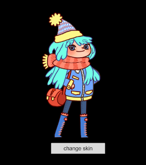

1. 首先在 **层级管理器** 中新建一个 Canvas 节点，然后在 Canvas 节点下新建一个空节点并命名为 girl。选中 girl 节点并在 **属性检查器** 中添加 Skeleton 组件，将资源拖拽至 Skeleton 组件的 SkeletonData 属性框中。可更改 Skeleton 组件的 Animation 属性用于设置想要播放的动画。

    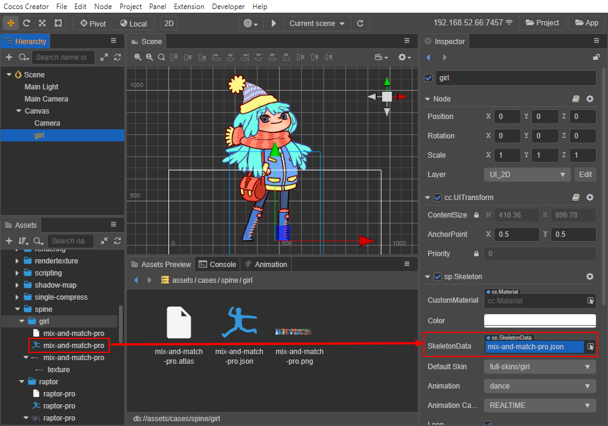

2. 在 **资源管理器** 中新建一个 TypeScript 脚本并命名为 SpineSkin，编写组件脚本。脚本代码如下：

    ```ts
    import { _decorator, Component, sp } from 'cc';
    const { ccclass, property } = _decorator;

    @ccclass('SpineSkin')
    export class SpineSkin extends Component {

        @property({ type:sp.Skeleton })
        spine: sp.Skeleton | null = null;

        skinId: number = 0;

        start () {
            // Your initialization goes here.
        }

        change() {
            const skins =['girl', 'boy', 'girl-blue-cape', 'girl-spring-dress'].map(x=> `full-skins/${x}`);
            this.skinId = (this.skinId + 1) % skins.length;
            this.spine!.setSkin(skins[this.skinId]);
        }

        // update (deltaTime: number) {
        //     // Your update function goes here.
        // }
    }
    ```

3. 然后将 `SpineSkin` 脚本挂载到 Canvas 节点上，即将脚本拖拽到 Canvas 节点的 **属性检查器** 中。再将 **层级管理器** 中的 `girl` 节点拖拽到 `SpineSkin` 脚本组件对应的属性框中，并保存场景。

    

4. 接下来我们需要利用 Button 组件的点击事件来触发 SpineSkin 脚本中的 `change` 回调，实现通过点击按钮来切换皮肤。

    在 **层级管理器** 的 Canvas 节点下新建一个 Button 节点并命名为 `change_skin`，根据需要调整其位置、大小、文字显示等属性。

    然后在 **属性检查器** 中设置 `change_skin` 节点的点击事件，将挂载了 `SpineSkin` 脚本组件的 Canvas 节点拖拽到 `ClickEvents` 属性的 `cc.Node` 属性框中，指定脚本组件为 `SpineSkin`，并设置回调为 `change`：

    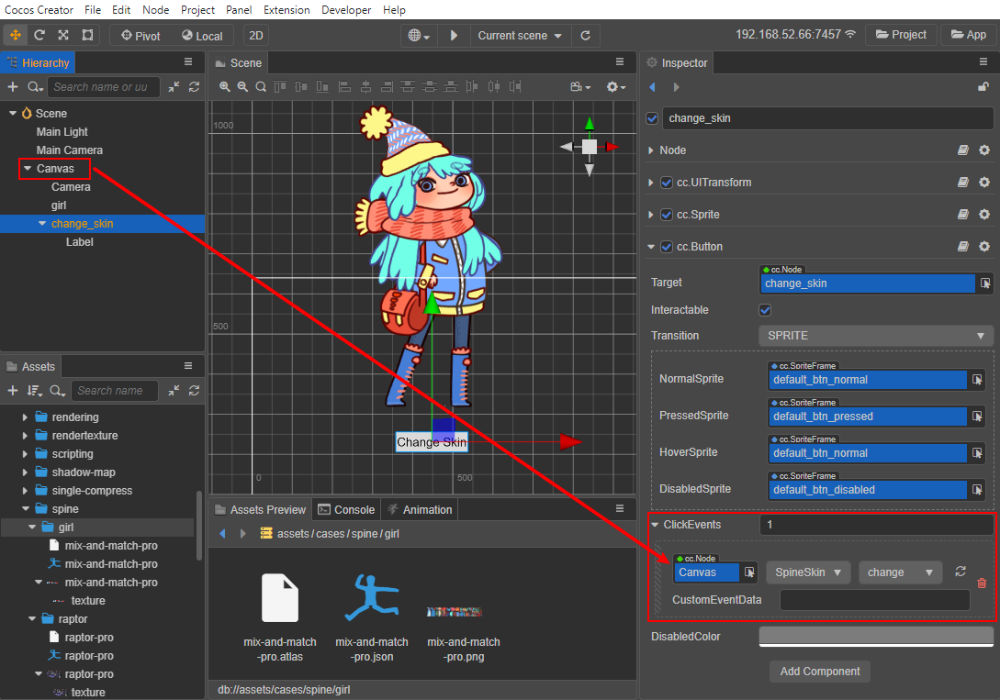

5. 根据需要调整场景结构，保存场景后点击编辑器上方的预览按钮，点击 change skin 按钮，可以看到人物皮肤已被替换。

    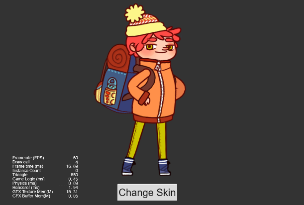

    > **注意**：若预览时未显示场景，请检查各节点的 Layer 属性是否与 Camera 节点的保持一致。
    >
    > 

## Spine 顶点效果

顶点效果只有当 Spine Skeleton 组件的 **Animation Cache Mode** 属性设置为 **REALTIME** 模式时有效，下面通过一个范例介绍 Spine 如何设置顶点效果。

1. 首先在 **层级管理器** 中新建一个 Canvas 节点，然后在 Canvas 节点下新建一个空节点并命名为 `Spine`。选中 `Spine` 节点，并在 **属性检查器** 中添加 Skeleton 组件，将资源拖拽到 Skeleton 组件的 SkeletonData 属性框中，设置好 Skeleton 组件属性。

2. 在 **资源管理器** 中新建一个 TypeScript 脚本并命名为 `SpineExample`，编写组件脚本。脚本代码如下：

    ```ts
    import { _decorator, Component, sp } from 'cc';
    const { ccclass, property } = _decorator;

    @ccclass('SpineExample')
    export class SpineExample extends Component {

        @property({ type:sp.Skeleton })
        skeleton: sp.Skeleton | null = null;
    
        private _jitterEffect?:sp.VertexEffectDelegate;

        start () {
            this._jitterEffect = new sp.VertexEffectDelegate();
            // 设置好抖动参数。
            this._jitterEffect.initJitter(20, 20);
            // 调用 Skeleton 组件的 setVertexEffectDelegate 方法设置效果。
            this.skeleton!.setVertexEffectDelegate(this._jitterEffect!);
        }

    };
    ```

3. 然后将 `SpineExample` 脚本挂载到 Canvas 节点上，即将脚本拖拽到节点的 **属性检查器** 中。再将 **层级管理器** 中挂载了 Skeleton 组件的 `Spine` 节点拖拽到脚本组件对应的 Skeleton 属性框中，并保存场景。

4. 点击编辑器上方的预览按钮，即可看到 Spine 动画顶点抖动的效果。详情可参考 **SpineMesh**（[GitHub](https://github.com/cocos/cocos-test-projects/tree/v3.0/assets/cases/spine) | [Gitee](https://gitee.com/mirrors_cocos-creator/test-cases-3d/tree/v3.0/assets/cases/spine)）范例。

## Spine 挂点

在使用骨骼动画时，经常需要在骨骼动画的某个部位上挂载节点，以实现节点与骨骼动画联动的效果。我们可以通过使用编辑器和脚本两种方式来实现 Spine 挂点。下面通过一个范例来介绍 Spine 如何使用挂点将星星挂在龙的尾巴上，并随一起晃动。


### 通过编辑器实现 Spine 挂点

1. 首先在 **层级管理器** 中新建一个 Canvas 节点，然后在 Canvas 节点下新建一个空节点并命名为 `Spine`。选中 `Spine` 节点，并在 **属性检查器** 中添加 Skeleton 组件，将资源拖拽到 Skeleton 组件的 SkeletonData 属性框中，设置好 Skeleton 组件属性。

2. 在 **层级管理器** 中右键点击 Spine 节点，选择 **创建 -> 2D 对象 -> Sprite** 为其添加一个子节点并命名为 `star`。然后将星星资源拖拽到 **属性检查器** 中 Sprite 组件的 `SpriteFrame` 属性上。

    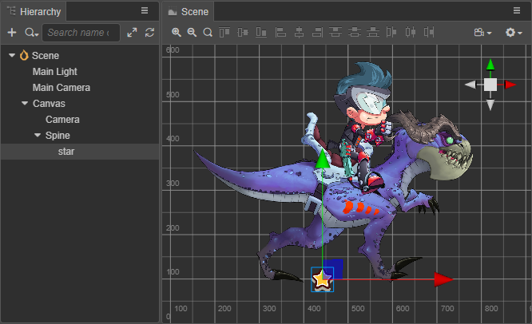

3. 在 **层级管理器** 中选中 Spine 节点，在 **属性检查器** 中将 Skeleton 组件的 Sockets 属性设置为 1（Sockets 属性的值代表了挂点的数量）。

    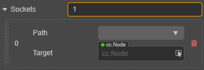

4. 然后设置 Sockets 中的 `Path` 和 `Target` 属性，`Path` 的下拉框中会列出所有的骨骼，选择想要挂载的目标骨骼，这里以龙的尾巴为例，然后将 `star` 节点拖拽到 `Target` 属性框中。即可在 **场景编辑器** 中看到星星挂在了龙的尾巴上。

    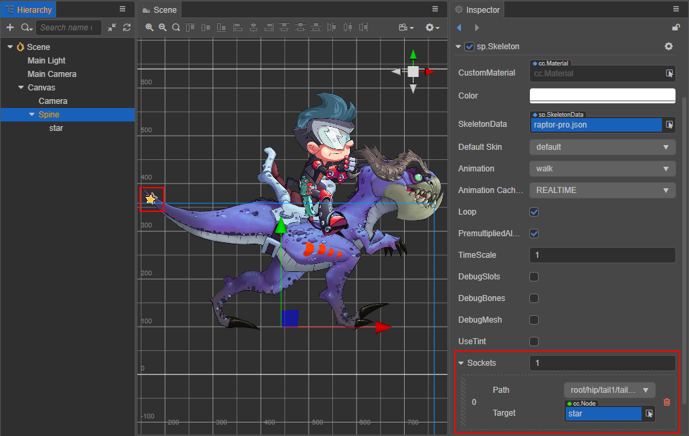

5. 保存场景，点击编辑器上方的预览按钮，也可以看到星星挂在龙的尾巴上，并随着龙的尾巴一起晃动。具体可参考官方 **SpineAttach**（[GitHub](https://github.com/cocos/cocos-test-projects/tree/v3.0/assets/cases/spine) | [Gitee](https://gitee.com/mirrors_cocos-creator/test-cases-3d/tree/v3.0/assets/cases/spine)）范例。

### 通过脚本实现 Spine 挂点

1. 前两个步骤与通过编辑器实现的一致。

2. 在 **资源管理器** 中新建一个 TypeScript 脚本并命名为 `SpineAttach`，编写组件脚本。脚本代码如下：

    ```ts
    import { _decorator, Component, sp, Label, Node } from 'cc';
    const { ccclass, property } = _decorator;

    @ccclass('SpineAttach')
    export class SpineAttach extends Component {

        @property({ type: sp.Skeleton })
        skeleton: sp.Skeleton = null!;

        @property({ type: Node })
        attachNode: Node = null!;

        start () {
            var socket = new sp.SpineSocket("root/hip/tail1/tail2/tail3/tail4/tail5/tail6/tail7/tail8/tail9/tail10", this.attachNode); // 第一个参数传入的是挂点的目标骨骼。第二个参数传入的是挂点的节点
            this.skeleton!.sockets.push(socket);
            this.skeleton!.sockets = this.skeleton!.sockets;
        }

    }
    ```

    > **注意**：若不知道目标骨骼的名称，可将 Spine 组件中的 Sockets 属性设置为 1，然后在 `Path` 的下拉框中查找所需的目标骨骼名称。查找完成后再将 Sockets 属性还原为 0 即可。

3. 然后将 `SpineAttach` 脚本挂载到 Canvas 节点或者其他节点上，即将脚本拖拽到节点的 **属性检查器** 中。再将 **层级管理器** 中挂载了 Skeleton 组件的 `Spine` 节点和 `star` 节点分别拖拽到脚本组件对应的 Skeleton 属性框和 AttachNode 属性框中，并保存场景。

    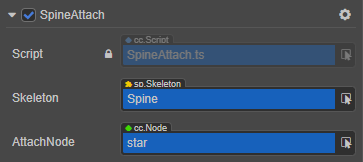

4. 点击编辑器上方的预览按钮，即可看到星星挂在龙的尾巴上，并随着龙的尾巴一起晃动。

    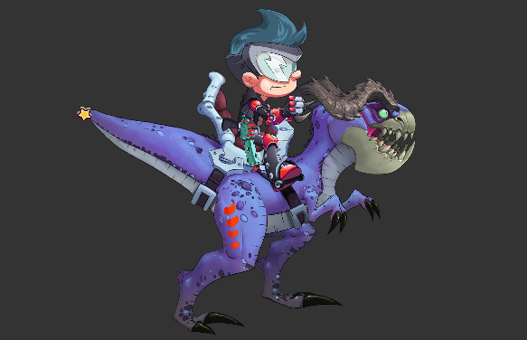

## Spine 碰撞检测

通过 Spine 挂点功能可以对骨骼动画的某个部位做碰撞检测。下面通过一个范例来介绍 Spine 如何实现碰撞检测，通过判断人物脚与地面接触与否来实现当人物跑动时，动态地改变地面颜色。

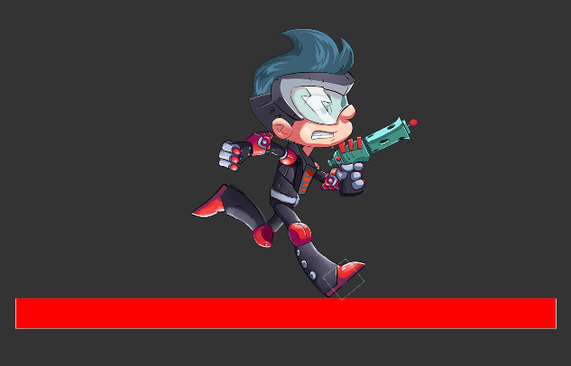

1. 首先需要在编辑器菜单栏的 **项目 -> 项目设置 -> 功能裁剪** 中将 **2D 物理系统** 设置为 **内置 2D 物理系统**。

    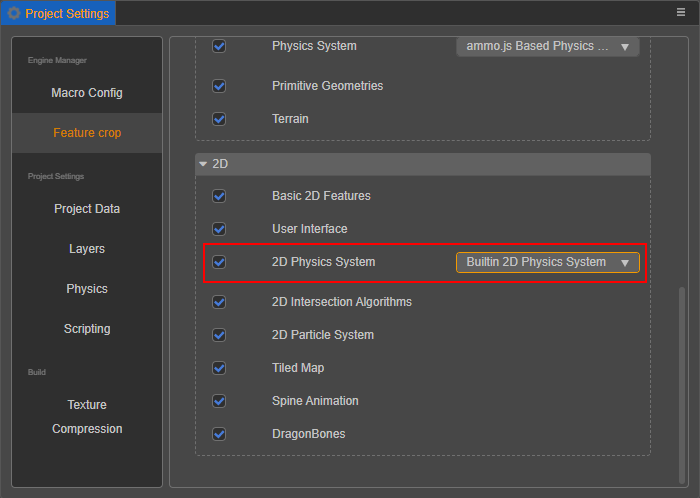

2. 与 Spine 挂点的前两个步骤一样，创建好 Spine 节点和其空子节点（命名为 `frontFoot`），以及 Sprite 节点作为地面（命名为 `Ground`），并设置好位置大小等属性。

    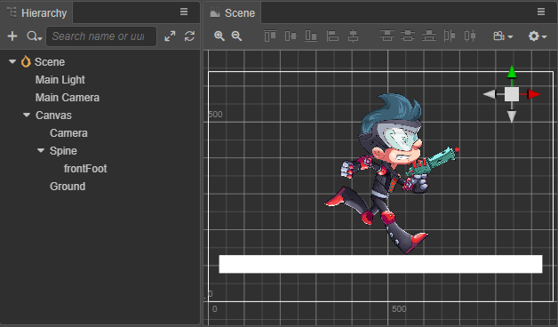

3. 在 **层级管理器** 中选中 frontFoot 节点，在 **属性检查器** 中点击 **添加组件 -> Physics2D -> Colliders -> Polygon Collider2D** 添加碰撞组件，然后设置好碰撞组件参数。

    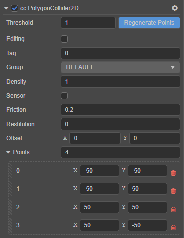

    参考通过编辑器实现 Spine 挂点的第 3、4 个步骤，将 frontFoot 节点挂载到 Sprite 节点的目标骨骼上（例如脚上），frontFoot 节点便会随着骨骼动画一起运动，从而碰撞组件的包围盒也会实时地与骨骼动画保持同步。

    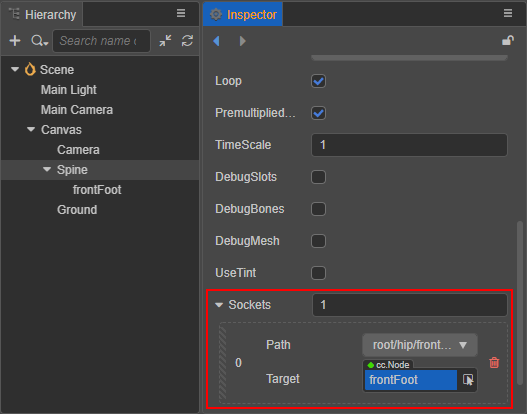

4. 在 **层级管理器** 中选中 Ground 节点，在 **属性检查器** 中点击 **添加组件 -> Physics2D -> Colliders -> BoxCollider2D** 添加碰撞组件，然后设置好碰撞组件参数。

5. 在 **资源管理器** 中新建一个 TypeScript 脚本并命名为 `SpineCollider`，然后将脚本挂载到地面节点 `Ground` 上。脚本代码如下：

    ```ts
    import { _decorator, Component, Node, PhysicsSystem2D, Contact2DType, Collider2D, Color, Sprite, ParticleSystem2D, EPhysics2DDrawFlags } from 'cc';
    const { ccclass } = _decorator;

    @ccclass('SpineCollider')
    export class SpineCollider extends Component {

        touchingCountMap : Map < Node, number > = new Map;

        private debugDrawFlags : number = 0;

        start () {
            // Your initialization goes here.
            PhysicsSystem2D.instance.on(Contact2DType.BEGIN_CONTACT, this.onBeginContact, this);
            PhysicsSystem2D.instance.on(Contact2DType.END_CONTACT, this.onEndContact, this);
            this.debugDrawFlags = PhysicsSystem2D.instance.debugDrawFlags;
        }

        onEnable () {
            PhysicsSystem2D.instance.debugDrawFlags = this.debugDrawFlags | EPhysics2DDrawFlags.Shape;
        }

        onDisable () {
            PhysicsSystem2D.instance.debugDrawFlags = this.debugDrawFlags;
        }

        addContact (c: Collider2D) {
            let count = this.touchingCountMap.get(c.node) || 0;
            this.touchingCountMap.set(c.node, ++count);

            let sprite = c.getComponent(Sprite);
            if (sprite) {
                sprite.color = Color.RED;
            }
        }

        removeContact (c: Collider2D) {
            let count = this.touchingCountMap.get(c.node) || 0;
            --count;
            if (count <= 0) {
                this.touchingCountMap.delete(c.node);

                let sprite = c.getComponent(Sprite);
                if (sprite) {
                    sprite.color = Color.WHITE;
                }
            } else {
                this.touchingCountMap.set(c.node, count);
            }
        }

        onBeginContact (a: Collider2D, b: Collider2D) {
            this.addContact(a);
            this.addContact(b);
        }

        onEndContact (a: Collider2D, b: Collider2D) {
            this.removeContact(a);
            this.removeContact(b);
        }
    }
    ```

6. 点击编辑器上方的预览按钮，即可看到效果。具体可参考 **SpineCollider**（[GitHub](https://github.com/cocos/cocos-test-projects/tree/v3.0/assets/cases/spine) | [Gitee](https://gitee.com/mirrors_cocos-creator/test-cases-3d/tree/v3.0/assets/cases/spine)）范例。

    > **注意**：由于挂点的实现机制，会导致基于挂点的碰撞检测存在延迟一帧的问题。

    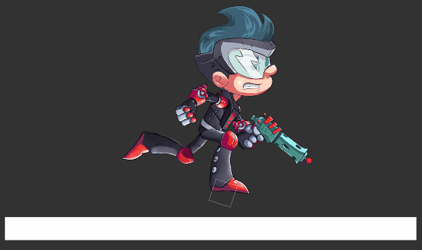
