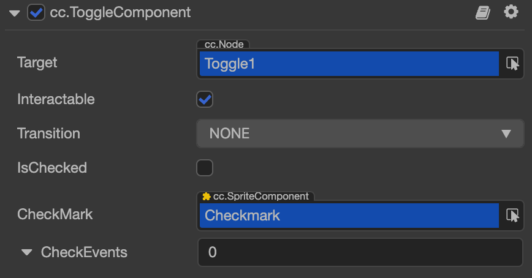

# Toggle Component Reference

The Toggle component is a CheckBox, when it's used together with a ToggleContainer, it could be treated as a RadioButton.



Click the __Add Component__ button at the bottom of the __Inspector__ panel and select __UI/Toggle__ to add the Toggle component to the node.

To use `Toggle`, please refer to the [Toggle API](%__APIDOC__%/en/#/docs/3.3/en/ui/Class/Toggle) documentation and the [Toggle](https://github.com/cocos-creator/test-cases-3d/tree/v3.3/assets/cases/ui/09.toggle) scene of the test-cases-3d project.

## Toggle Properties

| Property     | Function Explanation |
| -------------- | -----------   |
| IsChecked      | Boolean type. When set to true, enable the check mark component |
| CheckMark      | Sprite type. The image displayed when Toggle is selected |
| CheckEvents    | List type, default is null. Each event added by the user is composed of the node reference, component name and a response function. Please see the __Toggle Event__ section below for details |

> __Note__: because Toggle is inherited from Button, so the properties exists in Button also apply to Toggle, please refer to the [Button Component](button.md) for details.

## Toggle Event

For event structure you can refer to the [Button](./button.md) documentation.

The Toggle event callback has two parameters, the first one is the Toggle itself and the second is the `customEventData`.

## Detailed Explanation

The generic node hierarchy of Toggle is as below:


> __Note__: the checkMark node needs to be placed on the upper level of the background node in the __Scene__.

## Add a callback through the script code

### Method one

The event callback added by this method is the same as the event callback added by the editor, all added by code. First you need to construct a `EventHandler` object, and then set the corresponding `target`, `component`, `handler` and `customEventData` parameters.

```ts
import { _decorator, Component, Event, Node, ToggleComponent, EventHandler } from 'cc';
const { ccclass, property } = _decorator;

@ccclass("example")
export class example extends Component {
    onLoad(){
        const checkEventHandler = new EventHandler();
        // This Node is the node to which your event processing code component belongs
        checkEventHandler.target = this.node;
        // This is the script class name
        checkEventHandler.component = 'example';
        checkEventHandler.handler = 'callback';
        checkEventHandler.customEventData = 'foobar';

        const toggle = this.node.getComponent(ToggleComponent);
        toggle.checkEvents.push(checkEventHandler);
    }

    callback(event: Event, customEventData: string){
        // The event here is a Touch Event object, and you can get the send node of the event by event.target
        // The customEventData parameter here is equal to the "foobar" you set before
    }
}
```

### Method two

Added by the way of `toggle.node.on('toggle', ...)`.

```js
// // Suppose we add an event handler callback inside a component's onLoad method and event handlers in the callback function:

import { _decorator, Component, ToggleComponent } from 'cc';
const { ccclass, property } = _decorator;

@ccclass("example")
export class example extends Component {
    @property(ToggleComponent)
    toggle: ToggleComponent | null = null;
    onLoad(){
       this.toggle.node.on('toggle', this.callback, this);
    }

    callback(toggle: ToggleComponent){
        // The callback parameter is the Toggle component, note that events registered this way cannot pass customEventData.
    }
}
```
