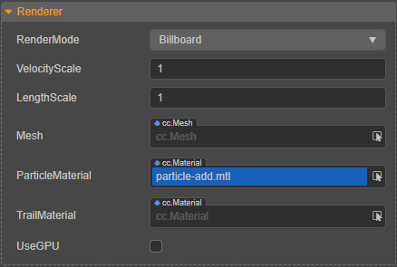

# 渲染模块（Renderer）

渲染模块用于生成粒子渲染所需要的数据。

| 属性 | 说明 |
| :--- | :--- |
| **RenderMode** | 设置粒子的生成方式，包括： **Billboard**：粒子显示为公告牌，并始终面向摄像机； **StretchedBillboard**：粒子始终面向摄像机，但会根据相关参数进行拉伸； **HorizontalBillboard**：粒子始终与 X-Z 平面平行 **VerticalBillboard**：粒子始终与 Y 轴平行，但会朝向摄像机； **Mesh**：以指定的网格资源渲染粒子。 |
| **VelocityScale** | 当 **RenderMode** 设置为 **StretchedBillboard** 模式时，根据粒子 **速度大小** 按比例进行拉伸。 当设置为 0 时，可禁用基于速度的拉伸。 |
| **LengthScale** | 当 **RenderMode** 设置为 **StretchedBillboard** 模式时，根据粒子 **大小** 按比例进行拉伸。 当设置为 0 时，相当于粒子大小为 0，粒子会消失。 |
| **Mesh** | 当 **RenderMode** 设置为 **Mesh** 时，指定粒子渲染的网格资源。 |
| **ParticleMaterial** | 用于粒子渲染的材质。 当使用 CPU 渲染器，也就是不勾选 **UseGPU** 时，材质使用的 `effect` 只能选择 Creator 内置的 `builtin-particle`，不支持其它的 `effect`。 当使用 GPU 渲染器，也就是勾选 **UseGPU** 时，材质使用的 `effect` 只能选择 Creator 内置的 `builtin-particle-gpu`，不支持其它的 `effect`。 |
| **TrailMaterial** | 用于渲染粒子拖尾的材质，材质的 effect 只支持 `builtin-particle-trail`，不支持其它的 effect。 |
| **UseGPU** | 若不勾选该项（默认），使用 **CPU 渲染器** 进行粒子的渲染。 若勾选该项，使用 **GPU 渲染器** 进行粒子的渲染。 详情请参考下文 **粒子渲染器** 部分的内容。 |

## 粒子渲染器

粒子渲染部分由 **渲染器** [ParticleSystemRenderer](%__APIDOC__%/zh/#/docs/3.3/zh/particle/Class/ParticleSystem) 控制，渲染器分为 **CPU 渲染器**（默认）和 **GPU 渲染器**，可通过渲染模块中的 **UseGPU** 属性选择使用。

- CPU 渲染器（ParticleSystemRendererCPU）通过一个对象池来维护所有粒子，根据粒子当前状态来生成对应的 VB、IB 数据，持有粒子需要渲染的材质，并且保存相关渲染状态。粒子系统默认使用 CPU 渲染器。

- GPU 渲染器（ParticleSystemRendererGPU）目前是在 CPU 端生成粒子，只提交初始参数的 VB、IB 数据，但模块相关的计算则是通过预采样数据的形式，在初始化时提交一次数据。后续的模块系统则是在 GPU 端对数据进行提取模拟运算，减少 CPU 端的计算压力。 
可通过勾选 **UseGPU** 属性选择使用 GPU 渲染器。目前暂不支持 [拖尾模块](./trail-module.md) 和 [限速模块](./limit-velocity-module.md)。
