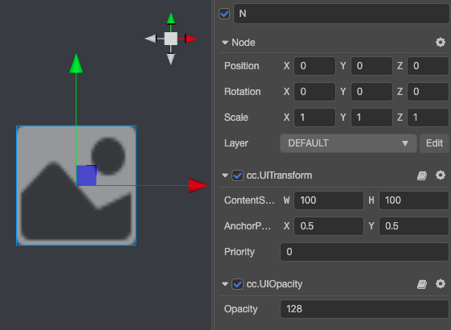

# UIOpacity Component References

The UIOpacity Component records a transparency modification flag for the node, which is used to influence all the render nodes inside its sub tree. Normally it's used on a non render nodes, otherwise its opacity will be multiplied with the render component's opacity. The render nodes can set transparency individually by setting the alpha channel of `color`.

> **Note**: this component is only functional when its root node have Canvas component or RenderRoot2D component.

The method of use is as follows:



You can also set transparency by code. Example:

```ts
const opacityComp = this.getComponent(UIOpacity);
opacityComp.opacity = 157;
```

To use `UIOpacity`, please refer to the [UIOpacity API](%__APIDOC__%/en/#/docs/3.4/en/ui/Class/UIOpacity) documentation and the [Opacity](https://github.com/cocos/cocos-test-projects/tree/v3.4/assets/cases/ui/other/opacity) scene of the test-cases-3d project.

## UIOpacity Properties

| Property | Function Description |
| -------- | ----------- |
| Opacity        | transparency |
