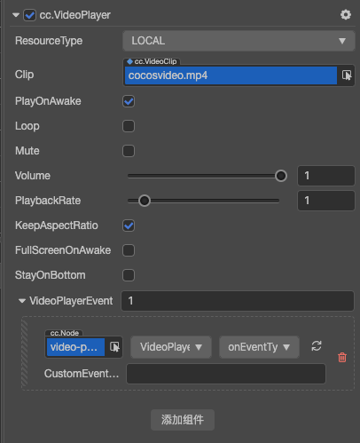
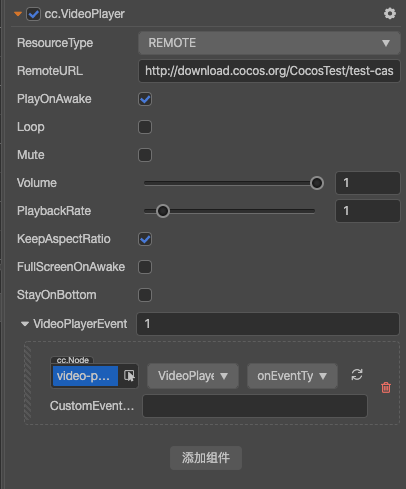
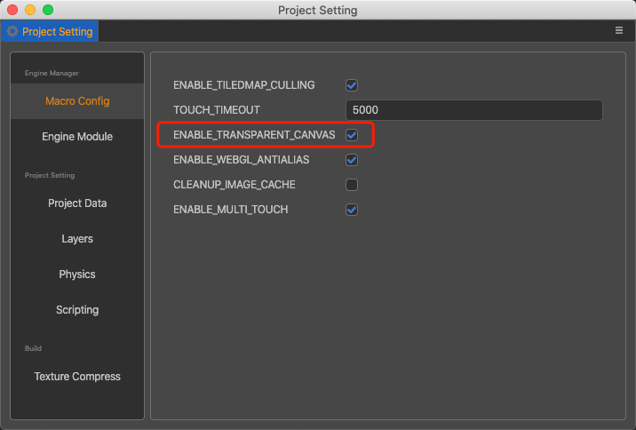
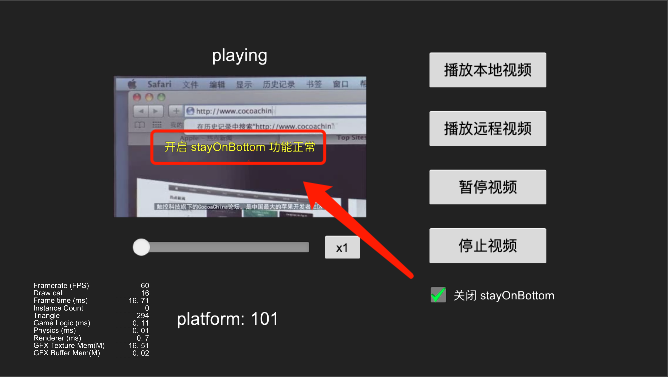

# VideoPlayer Component Reference

**VideoPlayer** is a component for playing videos, you could use this component for playing local video and remote videos.

**Playing a local video**:



**Playing a remote video**:



Click **Add Component** at the bottom of **Properties** panel and select **VideoPlayer** from **UI Component** to add the **VideoPlayer** component to the node.

For more information about **VideoPlayer**'s scripting interface, please refer to the [VideoPlayer API](%__APIDOC__%/en/#/docs/3.4/en/component-video/Class/VideoPlayer) documentation.

## VideoPlayer Properties

| Property | Function Explanation |
|:-------- | :----------- |
| **Resource Type**        | The resource type of videoplayer, REMOTE for remote url and LOCAL for local file path. |
| **Remote URL**           | Displayed when Resource Type is REMOTE, feed it with a remote video URL. |
| **Clip**                | Displayed when Resource Type is LOCAL, feed it with a local video path. |
| **Play On Awake**        | Whether the video start playing automatically after loaded? |
| **Current Time**         | The current playback time of the now playing item in seconds, you could also change the start playback time. |
| **Volume**               | The volume of the video. (0.0 ~ 1.0) |
| **Mute**                 | Mutes the VideoPlayer. Mute sets the volume=0, Un-Mute restore the original volume. |
| **Keep Aspect Ratio**    | Whether keep the aspect ratio of the original video. |
| **Full Screen On Awake** | Whether play video in fullscreen mode. |
| **Stay On Bottom**       | Display video below the game view (Only available on web). |
| **Video Player Event**   | The video player's callback, it will be triggered when certain event occurs. Please refer to the `VideoPlayer Event` section below or [VideoPlayerEvent API](%__APIDOC__%/en/#/docs/3.4/en/component-video/Class/VideoPlayer?id=videoplayerevent) for more details. |

> **Note**: in the **Node** of the **Video Player Event** property, you should fill in a Node that hangs the user script component, and in the user script you can use the relevant **VideoPlayer** event according to the user's needs.

## VideoPlayer Event

### VideoPlayerEvent Event

| Property      |   Function Explanation  |
| :--------------  | :----------- |
| **target**          | Node with the script component.|
| **component**       | Script component name.         |
| **handler**         | Specify a callback, when the video player is about to playing or paused, it will be called. There is a parameter in the callback which indicate the state of played videos.|
| **customEventData** | The user specifies that any string is passed in as the last parameter of the event callback |

For more information, please refer to the [Component.EventHandler Class](%__APIDOC__%/en/#/docs/3.4/en/event/Class/EventHandler) documentation.

### Parameter of VideoPlayerEvent

| Name           | Function Explanation          |
| :-------------- | :-----------                   |
| **NONE**           | None                          |
| **PLAYING**        | Video is playing.             |
| **PAUSED**         | Video is paused.              |
| **STOPPED**        | Video is stopped.             |
| **COMPLETED**      | Video is completed.           |
| **META_LOADED**    | Video's meta data is loaded.  |
| **READY_TO_PLAY**  | Video is ready to play.       |
| **ERROR**          | Video Trigger Error           |
| **CLICKED**        | Video is clicked by the user. (Only supports Web platform.) |

> **Note**: on iOS, due to the platform limitations, the **CLICKED** event can't be fired when **VideoPlayer** is in fullscreen mode. If you want to let the Video played in fullscreen and also fire the **CLICKED** event properly, you should use a **Widget** component to hack the **VideoPlayer's** size.

For more information, please refer to the [VideoPlayer Events](%__APIDOC__%/en/#/docs/3.4/en/component-video/Class/VideoPlayer?id=videoplayerevent) documentation or the [21.video-player example](https://github.com/cocos/cocos-test-projects/tree/v3.4/assets/cases/ui/21.video-player) in the `test-cases-3d` samples bundled with __Cocos Creator__.

## Detailed Explanation

The supported video types is **mp4** format.

### Add a callback via script

#### Method one

This method uses the same API that editor uses to add an event callback on Button component. You need to construct a `Component.EventHandler` object first, and then set the corresponding `target`, `component`, `handler` and `customEventData` parameters.

```ts
import { _decorator, Component, VideoPlayer } from 'cc';
const { ccclass, type } = _decorator;

@ccclass('MyComponent')
export class MyComponent extends Component {
    @type(VideoPlayer)
    videoPlayer = null;

    start () {
        const eventHandler = new Component.EventHandler();
        eventHandler.target = newTarget;
        eventHandler.component = "MyComponent";
        eventHandler.handler = "callback";
        eventHandler.customEventData = "foobar";
        this.videoplayer.videoPlayerEvent.push(eventHandler);
    }

    // the order of parameters should not change
    callback: function(videoplayer, eventType, customEventData) {
        // videoplayer is a VideoPlayer component instance
        // eventType is typed as VideoPlayer.EventType
        // customEventData is "foobar"
    }
}
```

#### Method two

Add event callback with `videoplayer.node.on(VideoPlayer.EventType.READY_TO_PLAY, ...)`

```ts
// Suppose we add event handling callbacks in the onLoad method of a component and perform event handling in the callback function:
import { _decorator, Component, find, VideoPlayer } from 'cc';
const { ccclass, type } = _decorator;

@ccclass('VideoPlayerCtrl')
export class VideoPlayerCtrl extends Component {
    @type(VideoPlayer)
    videoPlayer = null;

    start () {
        this.videoplayer.node.on(VideoPlayer.EventType.READY_TO_PLAY, this.callback, this);
    }

    callback (videoplayer) {
        // The "videoplayer" here represents the VideoPlayer component.
        // do whatever you want with videoplayer
        // you can't pass customEventData in this way
    }
}
```

Likewise, it is also posible to register the `meta-loaded`, `clicked`, `playing` events, and the parameters of the callback function for these events are consistent with the `ready-to-play` parameters.

Please refer to the [VideoPlayer API](%__APIDOC__%/en/#/docs/3.4/en/component-video/Class/VideoPlayer) documentation for details on **VideoPlayer** events.

> **Note**: as **VideoPlayer** is a special component, it cannot register `touch` or `mouse` events on the node with **VideoPlayer** component.

## How to display a UI upon a video

You can display a UI upon a video in two steps:

1. Make sure the **ENABLE_TRANSPARENT_CANVAS** checkbox is checked. It can be found in the **Macro Config** page in **Project Settings**

    

2. Check the **stayOnBottom** property on the **VideoPlayer** in the **Properties** panel.

> **Notes**:
> 1. This feature is only supported on Web.
> 2. The specific effects are not guaranteed to be consistent, depending on whether each browser supports or restricts.
> 3. After the **stayOnBottom** is enabled, the `clicked` event in `VideoPlayerEvent` cannot be listened normally.

For more information, please refer to the [21.video-player example](https://github.com/cocos/cocos-test-projects/tree/v3.4/assets/cases/ui/21.video-player) in the `test-cases-3d` samples bundled with __Cocos Creator__. Results as shown below:



## Support platform

Because different platforms have different authorization, API and control methods for **VideoPlayer** component. And have not yet formed a unified standard, only **Web**, **iOS**, **Android**, **WeChat Mini Games**, **Facebook Instant Games** and **Google Play Instant** platforms are currently supported.

### Questions about autoplay

Some mobile browsers or **WebView** do not allow auto-playing of videos and users need to play the video manually in a touch event.

```ts
import { _decorator, Node, Component, find, VideoPlayer } from 'cc';
const { ccclass, type } = _decorator;

@ccclass('VideoPlayerCtrl')
export class VideoPlayerCtrl extends Component {
    @type(VideoPlayer)
    videoPlayer = null;

    start () {
        let canvas = find('Canvas');
        canvas.on(Node.EventType.TOUCH_START, this.playVideo, this);
    }

    playVideo () {
        this.videoplayer.play();
    }
}
```
