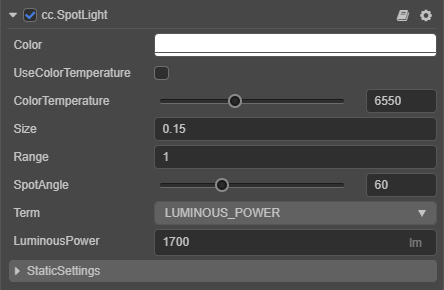
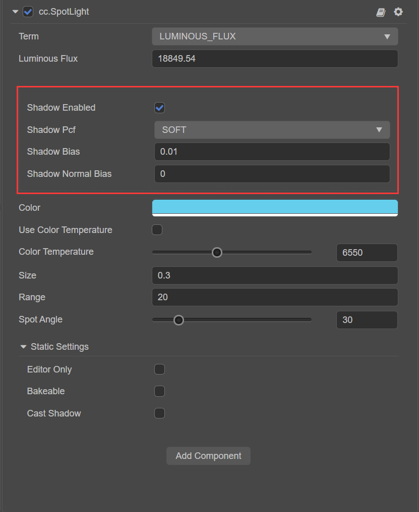

# Spotlights

A **Spotlight** is a cone-shaped beam of light emitted from a point in one direction, similar to the light produced by a flashlight or stage lighting. Compared to other lights, spotlights have an additional `SpotAngle` property, which is used to adjust the light range of the spotlight.

In the editor, one can clearly see the position, color and light range of the light as well as its spot angle, as shown in the following image. With the [Transform Gizmos](../../../../editor/toolbar/index.md) in the upper left corner of the editor, it is possible to adjust the position and direction of the spotlight.

See [Adding Lights](index.md#adding-lights) for how to add spotlights to a scene.

For the Spotlight component interface, please refer to [SpotLight API](%__APIDOC__%/en/class/SpotLight).

> **Note**: Starting with v3.5, **Spotlight Shadows** are separated from the Scene Settings panel and are no longer affected by the Global Shadows parameter.

## Spotlight Properties

| Property | Description |
| :------ | :--- |
| Color | Sets the color of the light. |
| UseColorTemperature | Whether to enable the color temperature. |
| ColorTemperature |Adjusts the color temperature. |
| Size | Sets the light size. |
| Range | Sets the range of light effect. |
| SpotAngle | Adjusts the spot angle to control the light range. |
| Term | Sets the light intensity unit type, including **LUMINOUS_POWER** and **LUMINANCE**.
| LuminousPower | Luminous flux in **lumens (lm)**.  Effective when **Term** is set to **LUMINOUS_POWER**. |
| Luminance | Brightness in **Candela per square meter (cd/m2)**. Effective when **Term** is set to **LUMINANCE**. |
| StaticSettings | Static lighting settings, please refer to the [Lightmapping](../lightmap.md) documentation. |

### Spotlight Shadow Properties

| Property | Explanation |
| :--- | :--- |
| ShadowEnabled        | Whether to enable the shadow effect. |
| ShadowPcf             | Set the anti-aliasing level of the shadow edge, currently including **HARD**, **SOFT**, **SOFT_2X**. Please refer to the section **PCF Soft Shadow** below for details.  |
| ShadowBias            | Set the shadow offset value to prevent z-fitting. |
| ShadowNormalBias      | Set the normal offset value. |

#### PCF Soft Shadow

Percentage Closer Filtering (PCF) is a simple, common technique used to achieve shadow edge desampling, by smoothing shadow edges to eliminate jaggedness in shadow mapping. The principle is to sample around the current pixel (also called a fragment), then calculate the ratio of the sample closer to the lights compared to the fragment, use this ratio to scale the scattered light and specular light, and then color the fragment to blur the shadow edges.

Cocos Creator currently supports **hard sampler (HARD mode)**, **4x sampler (SOFT mode)**, **9x sampler (SOFT_2X mode)**. The larger the magnification, the larger the sampling area and the more softer the shadow edges.
