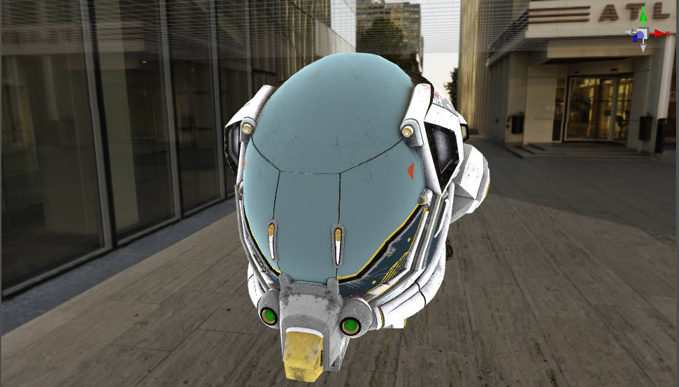
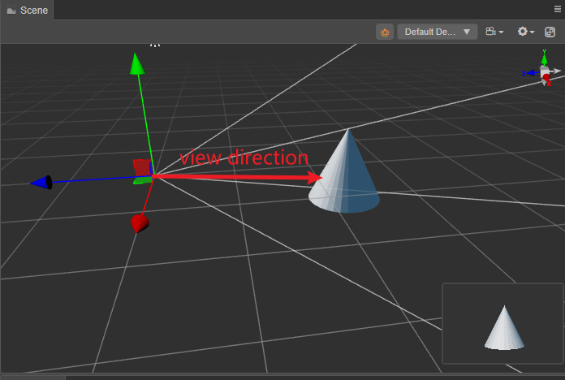
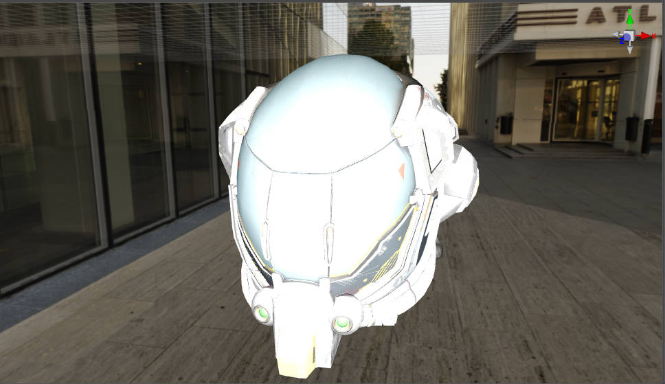
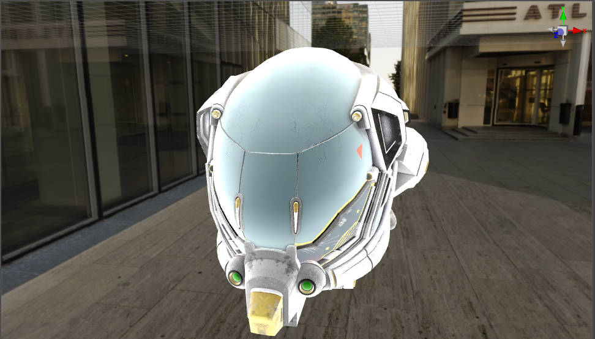
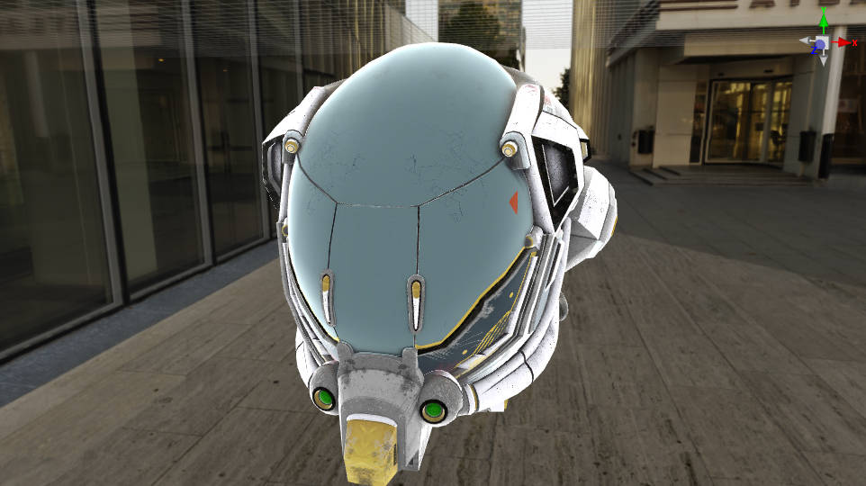
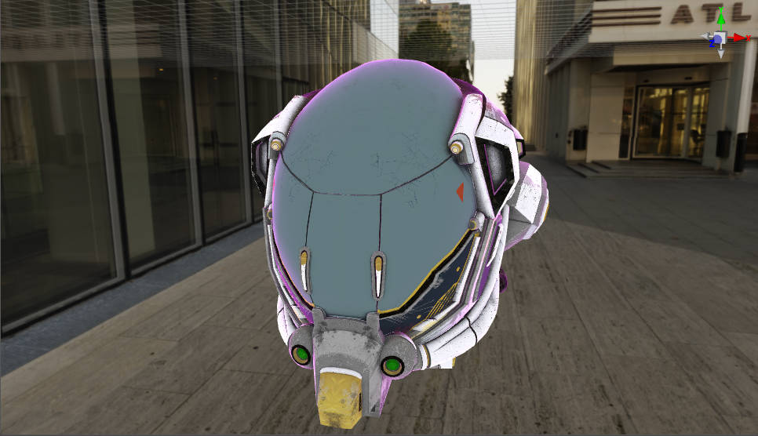
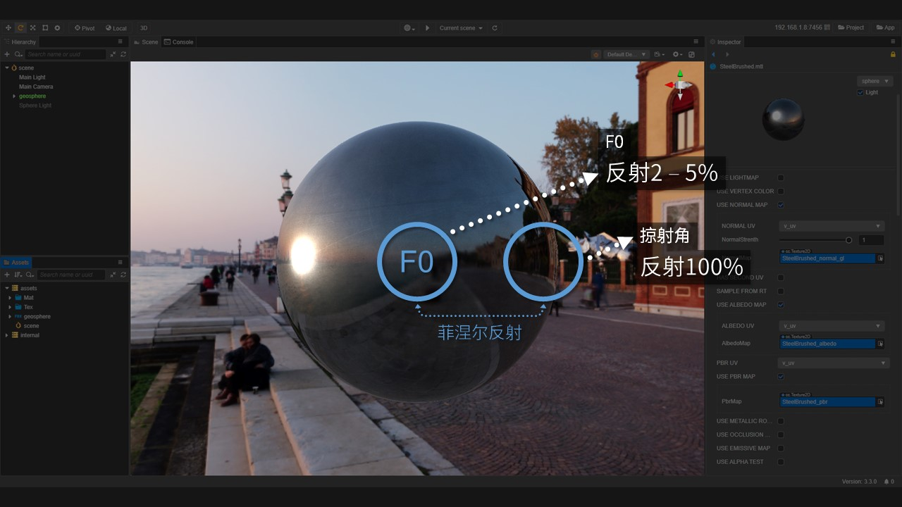

# 3D Effect：RimLight

This article will demonstrate how to write a shader (Cocos Effect) that can be used in Cocos for 3D model rendering by implementing a RimLight effect.

**RimLight** is a technique that makes objects more vivid by making their edges emitting.

**RimLight** is an application of the Fresnel phenomenon [^1], a simple and efficient shader for enhancing rendering by calculating the magnitude of the angle between the object normals and the view direction, and adjusting the position and color of the light emitted.

In the calculation of rim-light, the greater the angle between the line of sight and the normal, the more pronounced the fringe light is.



## Material and effect creation

First refer to the [Effect asset](./effect-inspector.md) to create a new shader named **rimlight.effect** and create a material **rimlight.mtl** that uses that shader.


## CCEffect

Cocos Effect uses YAML as a parser, so CCEffect needs to be written in a way that adheres to the YAML syntax standard, for which you can refer to [YAML 101](./yaml-101.md).

In this example, the semi-transparent effect will not be considered for the time being, and the `transparent` part can be removed at this point.

```yaml
# Delete the following sections
- name: transparent
    passes:
    - vert: general-vs:vert # builtin header
      frag: rimlight-fs:frag
      blendState:
        targets:
        - blend: true
          blendSrc: src_alpha
          blendDst: one_minus_src_alpha
          blendSrcAlpha: src_alpha
          blendDstAlpha: one_minus_src_alpha
      properties: *props 
```

Modify the `frag` function in the `opaque` section to: `rimlight-fs:frag`, which is the slice shader part of the edge light to be implemented next.

```yaml
- name: opaque
  passes:
  - vert: general-vs:vert # builtin header
    frag: rimlight-fs:frag           
```

To make it easier to adjust the color of the rim light, add an attribute `rimLightColor` for adjusting the color of the rim light, and since translucency is not considered, only the RGB channel of this color is used.

```yaml
rimLightColor:  { value: [1.0, 1.0, 1.0],   # default values of RGB
                  target: rimColor.rgb,     # Bind to the RGB channel of Uniform rimColor
                  editor: {                 # Style definition in material's property inspector
                    displayName: Rim Color, # Show Rim Color as display name 
                    type: color } }         # The type of this field is a color value
```

The CCEffect code is as follows:

```yaml
CCEffect %{
  techniques:
  - name: opaque
    passes:
    - vert: general-vs:vert # builtin header
      frag: rimlight-fs:frag
      properties: &props
        mainTexture:    { value: white } 
        mainColor:      { value: [1, 1, 1, 1], editor: { type: color } }    
        # Rim Light's colors, which depend only on the components of the three RGB channels
        rimLightColor:  { value: [1.0, 1.0, 1.0], target: rimColor.rgb, editor: { displayName: Rim Color, type: color } }
}%
```

> **Note**: The corresponding `rimColor` field needs to be added to the `uniform Constant` of the fragment shader.
>
> ```glsl
> uniform Constant {        
>     vec4 mainColor;    
>     vec4 rimColor;  
> }; 
> ```

This binding means that the values of the RGB component of the shader's `rimLightColor` are transferred through the engine to the `rgb` three components of the Uniform `rimColor`.

> **Note**: The engine specifies that vectors of type vec3 cannot be used to avoid [implict padding](./effect-syntax.md), so when using a 3-dimensional vector (vec3), you can choose to use a 4-dimensional vector (vec4) instead. Don't worry, the alpha channel will be utilized without being wasted.

## Vertex shader

Usually the engine's built-in vertex shader can meet most of the development needs, so the engine's built-in vertex shader can be used directly.

```yaml
 - vert: general-vs:vert # builtin header
```

## Fragment shader

Modify the fragment shader code in the shader created via **Assets** panel by changing `CCProgram unlit-fs` to `CCProgram rimlight-fs`.

Before modification:

```glsl
CCProgram unlit-fs %{
  precision highp float;
  ...
}%
```

After modification:

```glsl
CCProgram rimlight-fs %{
  precision highp float;
  ...
}%
```

In lighting calculations, it is usually necessary to calculate the angle between the normal and the line of sight, which is closely related to the **camera position**.



As shown above, to calculate the line of sight, you need to subtract the **position of the object** from the **camera position**. Within the shader, to get the **camera position**, you need to use `cc_cameraPos` in [Built-in Shader Uniforms](uniform.md), which is stored inside the `cc-global` shader fragment. This uniform is stored in the `cc-global` shader fragment via [`include`](./effect-chunk-index.md) keyword, the entire shader fragment can be easily introduced.

```glsl
#include <cc-global>  // Include Cocos Creator built-in global uniforms
```

Now the fragment shader is as follows:

```glsl
CCProgram rimlight-fs %{
  precision highp float;  
  #include <cc-global>  // Include Cocos Creator built-in global uniforms
  #include <output>
  #include <cc-fog-fs>

  ...
}
```

The view direction is calculated by subtracting the current camera position (`cc_cameraPos`) from the position information passed in by the vertex shader within the slice shader `in vec3 v_position`.

```glsl
vec3 viewDirection = cc_cameraPos.xyz - v_position; // Caculate the view direcion
```

We don't care about the length of the view vector, so we get `viewDirection` and normalize it with the `normalize` method.

```glsl
vec3 normalizedViewDirection = normalize(viewDirection);  // Normalize the view direciton
```

The xyz component of `cc_cameraPos` represents the position of the camera.

The fragment shader code is as follows:

```glsl
  vec4 frag(){ 
    vec3 viewDirection = cc_cameraPos.xyz - v_position; // Calculate the view direciton
    vec3 normalizedViewDirection = normalize(viewDirection);  // Normalize view direction
    vec4 col = mainColor * texture(mainTexture, v_uv); // Calculate the final color
    CC_APPLY_FOG(col, v_position);
    return CCFragOutput(col);  
  }
```

Next, you need to calculate the angle between the normal and the view direction. Since the built-in standard vertex shader `general-vs:vert` is used, the normal has been passed from the vertex shader to the fragment shader, but is not declared.

The following code demonstrates how to declare normals：

```glsl
in vec3 v_normal;
```

The fragment shader code at this point is as follows:

```glsl
CCProgram rimlight-fs %{
  precision highp float;
  #include <cc-global>
  #include <output>
  #include <cc-fog-fs>

  in vec2 v_uv;
  in vec3 v_normal;
  in vec3 v_position;

  ....
}
```

The normal is no longer in a normalized state due to the interpolation of the pipeline, so it needs to be normalized, using the `normalize` function to do so.

```glsl
vec3 normal = normalize(v_normal);  // Renormalize the normals.
```

The code of the fragment shader at this point is as follows:

```glsl
vec4 frag(){ 
    vec3 normal = normalize(v_normal);  // Renormalize the normals.
    vec3 viewDirection = cc_cameraPos.xyz - v_position; // Calculate the view direction
    vec3 normalizedViewDirection = normalize(viewDirection);  // Normalization of the view direction
    vec4 col = mainColor * texture(mainTexture, v_uv); // Calculate the final color
    CC_APPLY_FOG(col, v_position);
    return CCFragOutput(col);  
}
```

At this point, the angle between the normal and the view direction can be calculated. Inside linear algebra, the dot product is expressed as the cosine of the modulus of two vectors multiplied by the angle.

```txt
a·b = |a|*|b|*cos(θ)
```

A simple exchange law leads to.

```txt
cos(θ) = a·b /(|a|*|b|)
```

Since the normal and view directions are normalized, they are modulo 1 and the result of the dot product is expressed as the cos values of the normal and view directions.

```txt
cos(θ) = a·b
```

Translate this into code as follows:

```glsl
dot(normal, normalizedViewDirection)
```

Note that the dot product may be calculated to be less than 0, while the color is positive, and is bounded in the range [0, 1] by the `max` function.

```glsl
max(dot(normal, normalizedViewDirection), 0.0)
```

In this case, the RimLight color can be adjusted according to the result of the dot product:

```glsl
float rimPower = max(dot(normal, normalizedViewDirection), 0.0);// Calculating the intensity in RimLight
vec4 col = mainColor * texture(mainTexture, v_uv); // Calculate the final color
col.rgb += rimPower * rimColor.rgb; // Increase rim-light
```

The fragment shader code is as follows:

```glsl
vec4 frag(){ 
    vec3 normal = normalize(v_normal);// 重新归一化法线。
    vec3 viewDirection = cc_cameraPos.xyz - v_position; // 计算视线的方向
    vec3 normalizedViewDirection = normalize(viewDirection);  // 对视线方向进行归一化
    float rimPower = max(dot(normal, normalizedViewDirection), 0.0); // 计算 RimLight 的亮度
    vec4 col = mainColor * texture(mainTexture, v_uv); // 计算最终的颜色
    col.rgb += rimPower * rimColor.rgb; // 增加边缘光
    CC_APPLY_FOG(col, v_position);
    return CCFragOutput(col);  
}
```

t can be observed that the center of the object is brighter than the edges because the angle between the normal of the edge vertex and the angle of view is larger and the cosine value obtained is smaller.

> **Note**: If you cannot observe the effect in this step, you can adjust `MainColor` so that it is not white. This is because the default `MainColor` color is white, covering up the color of the edge light.



To adjust this result by simply subtracting the result of the dot product by 1, delete the following code.

~~``` float rimPower = max(dot(normal, normalizedViewDirection), 0.0); ```~~

And add the following code:

```glsl
float rimPower = 1.0 - max(dot(normal, normalizedViewDirection), 0.0);
```

The fragment shader code is as follows:

```glsl
vec4 frag(){ 
    vec3 normal = normalize(v_normal);  // Renormalize the normals.
    vec3 viewDirection = cc_cameraPos.xyz - v_position; // Calculate the view direction
    vec3 normalizedViewDirection = normalize(viewDirection);  // Normalize the view direction
    float rimPower = 1.0 - max(dot(normal, normalizedViewDirection), 0.0);
    vec4 col = mainColor * texture(mainTexture, v_uv); // Calculate the final color
    col.rgb += rimPower * rimColor.rgb; // Add rim-light
    CC_APPLY_FOG(col, v_position);
    return CCFragOutput(col);  
}
```



Although the edge light effect can be observed, the light is too strong and not easily adjustable. An adjustable parameter `rimIntensity` can be added to the CCEffect. Since the alpha component of `rimColor` was not used before, borrowing this component for binding saves additional Uniform.

> **Note**: When writing shaders, you need to avoid implict padding, for this see: [UBO memory layout](./effect-syntax.md), where using the unused alpha channel to store the intensity of the edge light maximizes the use of the `rimColor` field.

Add the following code to CCEffect.

```yaml
rimInstensity:  { value: 1.0,         # Default value is 1
                  target: rimColor.a, # Bind to the alpha channel of ‘rimColor’
                  editor: {           # The style of the property inspector
                  slide: true,        # Use the slider as the display style
                  range: [0, 10],     # The range of values for the slider
                  step: 0.1 }         # Value change each time the adjustment button is clicked
```

The CCEffect code at this point is as follows:

```yaml
CCEffect %{
  techniques:
  - name: opaque
    passes:
    - vert: general-vs:vert # builtin header
      frag: rimlight-fs:frag
      properties: &props
        mainTexture:    { value: white } 
        mainColor:      { value: [1, 1, 1, 1], editor: { type: color } }    
        # Rim Light's colors, which depend only on the components of the three rgb channels
        rimLightColor:  { value: [1.0, 1.0, 1.0], target: rimColor.rgb, editor: { displayName: Rim Color, type: color } }
        # The alpha channel of rimLightColor is not used and is reused to describe the intensity of rimLightColor.
        rimInstensity:  { value: 1.0, target: rimColor.a, editor: {slide: true, range: [0, 10], step: 0.1}}   
}%               

```

Adding this property will add an adjustable RimIntensity to the material **Inspector** panel.


The `pow` function adjusts the edge light so that its range does not vary linearly, which can reflect a better effect, by removing the following code.

~~``` col.rgb += rimPower * rimColor.rgb; ```~~

Add the following codes:

```glsl
float rimInstensity = rimColor.a; // alpha channel is the index of brightness
col.rgb += pow(rimPower, rimInstensity) * rimColor.rgb;  // Exponential modification of dot product using 'pow' function
```

`pow` is a built-in GLSL function of the form `pow(x, p)`, which represents an exponential function with `x` as the base and `p` as the exponent.

The final fragment shader code is as follows:

```glsl
  vec4 frag(){ 
    vec3 normal = normalize(v_normal);  // Renormalize the normals
    vec3 viewDirection = cc_cameraPos.xyz - v_position; // Caculate the view direction
    vec3 normalizedViewDirection = normalize(viewDirection);  // Normalize the view direction
    float rimPower = 1.0 - max(dot(normal, normalizedViewDirection), 0.0);// Caculate the intensisty of rim-light
    vec4 col = mainColor * texture(mainTexture, v_uv); // Caculate the final color
    float rimInstensity = rimColor.a;  // alpha channel is the index of brightness
    col.rgb += pow(rimPower, rimInstensity) * rimColor.rgb; // Add rim-light
    CC_APPLY_FOG(col, v_position);  
    return CCFragOutput(col);  
  }
```

Afterwards, change the value of **rimIntensity** on the material **Inspector** panel to 3.


More natural edge lighting can be observed at this point.



The color and intensity of the rim light can be easily adjusted with **Rim Color** and **rimIntensity**.




The complete shader code is as follows:

```glsl
CCEffect %{
  techniques:
  - name: opaque
    passes:
    - vert: general-vs:vert # builtin header
      frag: rimlight-fs:frag
      properties: &props
        mainTexture:    { value: white } 
        mainColor:      { value: [1, 1, 1, 1], editor: { type: color } }    
        # Rim Light's colors, which depend only on the components of the three rgb channels
        rimLightColor:  { value: [1.0, 1.0, 1.0], target: rimColor.rgb, editor: { displayName: Rim Color, type: color } }
        # The alpha channel of rimLightColor is not used and is reused to describe the intensity of rimLightColor.
        rimInstensity:  { value: 1.0, target: rimColor.a, editor: {slide: true, range: [0, 10], step: 0.1}}   
}%

CCProgram rimlight-fs %{
  precision highp float;
  #include <cc-global>
  #include <output>
  #include <cc-fog-fs>

  in vec2 v_uv;
  in vec3 v_normal;
  in vec3 v_position;

  uniform sampler2D mainTexture;

  uniform Constant {
    vec4 mainColor;
    vec4 rimColor;  
  }; 
  vec4 frag(){     
    vec3 normal = normalize(v_normal);  // Renormalize the normals.
    vec3 viewDirection = cc_cameraPos.xyz - v_position; // Caculate view direction
    vec3 normalizedViewDirection = normalize(viewDirection);  // Normalize view direction
    float rimPower = 1.0 - max(dot(normal, normalizedViewDirection), 0.0);// Caculte the intensity of rim light
    vec4 col = mainColor * texture(mainTexture, v_uv); // Caculate the final color
    float rimInstensity = rimColor.a;  // alpha channel is the index of brightness
    col.rgb += pow(rimPower, rimInstensity) * rimColor.rgb; // Add rim light
    CC_APPLY_FOG(col, v_position); 
    return CCFragOutput(col);  
  }
}%
```

To make the color of the edge light affected by the texture color, the following code can be used.

Change the following code:

```glsl
col.rgb += pow(rimPower, rimInstensity) * rimColor.rgb; // Add rim light
```

To:

```glsl
col.rgb *= 1.0 + pow(rimPower, rimInstensity) * rimColor.rgb; // The rim light is influenced by the object coloring
```

The rim light is then influenced by the final texture and vertex color.


[^1]: Fresnel phenomenon: Augustin-Jean Fresnel was a famous French physicist in the 18th century, who proposed the Fresnel equation to explain the relationship between reflection and refraction of light very well. If you go to observe the calm water surface under the sunlight you can find that the further away from the observation point the stronger the reflection of the water surface, this phenomenon that the intensity of light changes with the angle of observation is known as Fresnel's phenomenon. <br>
