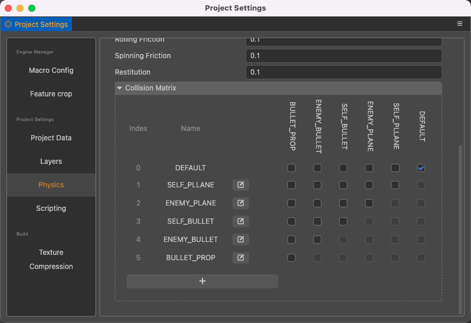

# Physical System Configuration

The PhysicsSystem module is used to manage the entire physics system and is responsible for synchronizing physics elements, triggering physics events, and scheduling iterations of the physics world.

## Physics Configuration

### Through the Physical Configuration panel

The **Project Settings -> Physical Configuration** allows you to configure the related physics system.


| Properties | Description |
| :--- | :--- |
| **Gravity X** | x-component of gravity |
| **Gravity Y** | y-component of gravity |
| **Gravity Z** | z-component of gravity |
| **AllowSleep** | Allow the system to sleep, default value `true` |
| **SleepThreshold** | The default speed threshold to enter sleep, default value `0.1`, minimum value `0` | | 
| **AutoSimulation** | Whether to enable auto simulation, default `true` |
| **FixedTimeStep** | Fixed time per simulation step, default `1/60`, min `0` |
| **MaxSubSteps** | The maximum number of sub-steps per step, default `1`, min `0` |
| **Friction** | Friction coefficient, default value `0.5` |
| **RollingFriction** | Rolling friction coefficient, default `0.1` |
| **SpinningFriction** | SpinFriction, default `0.1` |
| **Restitution** | Coefficient of elasticity, default `0.1` |
| **CollisionMatrix** | Collision matrix, for initialization only |

> **Note**: Currently **2D** / **3D** physics share a common configuration.

### Programmatic configuration

The physics system can be configured via `PhysicsSystem.instance`. Some code examples are as follows:

```ts
import { _decorator, Component, Node, Vec3, PhysicsSystem } from 'cc';
const { ccclass, property } = _decorator;
@ccclass('Example')
export class Example extends Component {
    start () {
        PhysicsSystem.instance.enable = true;
        PhysicsSystem.instance.gravity = new Vec3(0, -10, 0);
        PhysicsSystem.instance.allowSleep = false;
    }
}
```

> **Note**: The physics system is a singleton class, get an instance of the physics system via `PhysicsSystem.instance`.

The physics configuration can also be reset through the `PhysicsSystem.resetConfiguration` interface, with the following code example:

```ts
let conf = game.config.physics
conf.gravity = new Vec3(10, 10, 0);
PhysicsSystem.instance.resetConfiguration(conf);
```

For more API content, please check the PhysicsSystem interface please refer to: [PhysicsSystem API](%__APIDOC__%/en/class/physics.PhysicsSystem).

## Collision Matrix

The collision matrix is a further wrapper around the [Group and Mask](physics-group-mask.md) function, which is used to initialize the groups and masks of physics elements.


By default the collision matrix has only one **DEFAULT** group, new groups do not collide with other groups by default.

Click the **+** button to add a new group. The **Index** and **Name** of the new group cannot be left unfilled.

- **Index** represents the collision group value, which supports up to 32 bits, i.e. the value range is `[0, 31)`. Group values cannot be repeated.
- **Name** is the collision group name. The name set here is only for the convenience of the user to configure the collision group, it cannot be obtained by code, only the group value can be obtained by code.



The figure shows the configuration of a collider group for a flying shooter game. As you can see from the figure, when a group is added, the panel appears with the names of the groups both horizontally and vertically. Let's call the horizontal part **Group** and the vertical part **Mask**. Suppose we now make the following checkboxes:


This configuration means that the group **ENEMY_PLANE** can collide with the groups **ENEMY_BULLET** and **SELF_BULLET**. Here the group **ENEMY_BULLET** and **SELF_BULLET** are the masks of the group **ENEMY_PLANE**. Similarly, for the group **ENEMY_BULLET**, **ENEMY_PLANE** is also its mask.

Once the collision matrix is configured, you can add the **RigidBody** component to the object to be collided with and set the collision group `Group`.


> **Note**: groups cannot be deleted before v3.5, but the name of the group can be modified.
