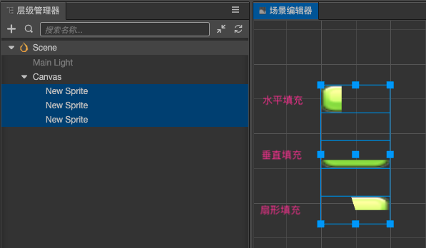

# Sprite Component Reference

Using Sprite is the most common way to display images in 2D/3D games. By adding the Sprite component to a Node, you can display __SpriteFrame__ assets from project assets.

Add a **Sprite** component to the node by clicking the __Add Component__ button below the __Inspector__ panel and selecting __2D -> Sprite__.

To use `Sprite`, please refer to the [Sprite API](%__APIDOC__%/en/class/Sprite) documentation and the [Sprite](https://github.com/cocos/cocos-test-projects/tree/v3.6/assets/cases/ui/01.sprite) scene of the test-cases-3d project.

## Sprite Properties

| Property | Function Explanation
| :-------------- | :----------- |
| **Type** | Rendering mode, currently includes four rendering modes: `SIMPLE`, `SLICED`, `TILED` and `FILLED`. Please refer to the **Rendering mode** section below for details.
| **CustomMaterial** | Custom Material, please refer to [UI Custom Material](../engine/ui-material.md)
| **GrayScale** | If enabled, Sprite will be rendered in gray scale mode.
| **Color** | Image color.
| **Sprite Atlas** | The [Atlas](../../../asset/atlas.md) to which the Sprite's image asset belongs.
| **Sprite Frame** | [Sprite Frame Assets](../../../asset/sprite-frame.md) which is used to render the Sprite.
| **Size Mode** | Specify the size of the Sprite. `TRIMMED` automatically fit to the size of the sprite cropped `RAW` automatic fit for sprite original size. `CUSTOM` use the node preset size. When the developer manually modifies `Size` properties, `Size Mode` will be automatically set to `Custom`.
| **Trim** | Whether the transparent pixel area is included in the node bounding box. Please refer to the [Auto Trim for SpriteFrame](../engine/trim.md) documentation.

After adding the Sprite component, drag the SpriteFrame type asset from the __Assets__ to the `Sprite Frame` property reference. Then, the asset image can be displayed through the Sprite component.

If this SpriteFrame asset is contained within an Atlas asset, then the `Atlas` property of the Sprite will be set up along with it.

> **Note**: to dynamically replace SpriteFrame, you need to dynamically load the image asset before you replace it, please refer to the [Acquire and load asset: how to dynamically load](../../../asset/dynamic-load-resources.md) documentation.

## Rendering mode

Currently, the Sprite component supports the following rendering modes:

- `Simple mode`: rendering the Sprite according to the original image asset. It is normally used along with `Use Original Size` to guarantee the image shown in the scene is in full accordance with the image designed by the graphic designer.

- `Sliced mode`: the image is cut up into a 9-slicing and according to certain rules is scaled to fit freely set dimensions (`size`). It is usually used in UI elements or to make images that can be enlarged infinitely without influencing the image quality. It will cut up the original image into a grid to save game asset space. Please read [Use a Sliced Sprite to make a UI image](../engine/sliced-sprite.md) for details.

- `Tiled mode`: The image will be repeated to fit the size of the Sprite. If the SpriteFrame is [9-sliced](../engine/sliced-sprite.md), the corners will also remain unscaled while the other areas will be repeated.

  

- `Filled mode`: draws a portion of the original image in a certain direction and scale, based on the origin and fill mode settings. Often used for dynamic display of progress bars.

### Filled mode

When the `Type` property selects `FILLED`, a new set of properties appears to be configured. So let's explain their roles in turn.

| Property |   Function Explanation
| :-------------- | :----------- |
| **Fill Type** | Fill type selection, including `HORIZONTAL`, `VERTICAL`, and `RADIAL`. |
| **Fill Start** | Normalized values for filling starting position (from 0 ~ 1, denoting the percentage of total population), when you select a horizontal fill, the `Fill Start` is set to 0, and it is populated from the leftmost edge of the image. |
| **Fill Range** | Normalized values for padding ranges (same from 0 ~ 1). When set to 1, it fills up the entire range of the original image. |
| **Fill Center** | Fill center point, this property can only be modified if the `RADIAL` fill type is selected. Determines which point on the Sprite is used as pivot when the FillType is set to RADIAL. |

#### Fill Range Supplemental description

Under both the `HORIZONTAL` and `VERTICAL` fill types, the values set by `Fill Start` affect the total number of fills, if `Fill Start` is set to 0.5, even if `Fill Range` is set to 1.0, the actual padding is still only half the total size of the Sprite.

The `Fill Start` in the `RADIAL` type only determines the orientation of the starting fill, when `Fill Start` is set to 0, start filling from the x axis positive direction.

`Fill Range` determines the total amount of padding, which fills the entire circle when `Fill Range` is set to 1. A counter anticlockwise fill when `Fill Range` is positive, and is filled clockwise when negative.
