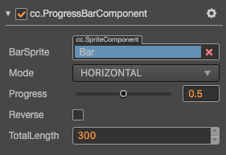

# ProgressBar 组件参考

ProgressBar（进度条）经常被用于在游戏中显示某个操作的进度，在节点上添加 ProgressBar 组件，然后给该组件关联一个 Bar Sprite 就可以在场景中控制 Bar Sprite 来显示进度了。

点击 **属性检查器** 下面的 **添加组件** 按钮，然后选择 **UI/ProgressBar** 即可添加 ProgressBar 组件到节点上。

进度条的脚本接口请参考 [ProgressBar API](%__APIDOC__%/zh/class/ProgressBar)。

关于使用可以参考范例 **Progress**（[GitHub](https://github.com/cocos/cocos-test-projects/tree/v3.6/assets/cases/ui/11.progress) | [Gitee](https://gitee.com/mirrors_cocos-creator/test-cases-3d/tree/v3.6/assets/cases/ui/11.progress)）。

## ProgressBar 属性

| 属性 |   功能说明
| :-------------- | :----------- |
| Bar Sprite | 进度条渲染所需要的 Sprite 组件，可以通过拖拽一个带有 **Sprite** 组件的节点到该属性上来建立关联。
| Mode | 支持 **HORIZONTAL**（水平）、**VERTICAL**（垂直）和 **FILLED**（填充）三种模式，可以通过配合 **reverse** 属性来改变起始方向。
| Total Length | 当进度条为 100% 时 Bar Sprite 的总长度/总宽度。在 **FILLED** 模式下 **Total Length** 表示取 Bar Sprite 总显示范围的百分比，取值范围从 0 ~ 1。
|Progress | 浮点，取值范围是 0~1，不允许输入之外的数值。
|Reverse | 布尔值，默认的填充方向是从左至右/从下到上，开启后变成从右到左/从上到下。

## 详细说明

添加 ProgressBar 组件之后，通过从 **层级管理器** 中拖拽一个带有 **Sprite** 组件的节点到 Bar Sprite 属性上，此时便可以通过拖动 progress 滑块来控制进度条的显示了。

Bar Sprite 可以是自身节点，子节点，或者任何一个带有 **Sprite** 组件的节点。另外，Bar Sprite 可以自由选择 Simple、Sliced 和 Filled 渲染模式。

进度条的模式选择 **FILLED** 的情况下，Bar Sprite 的 **Type** 也需要设置为 **FILLED**，否则会报警告。<!--详细使用说明请查阅[ProgressBar UI 控件介绍](../ui/ui-components.md#progressbar-)。-->
