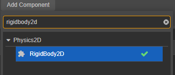
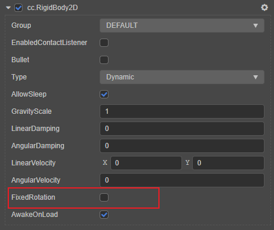
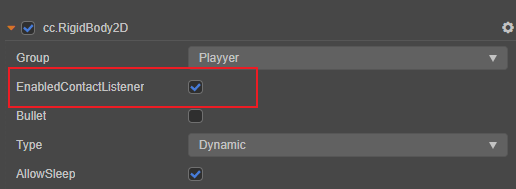
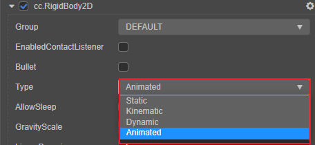

# 2D Rigidbody

A rigid body is the basic object that makes up the physical world and can be imagined as an object that you cannot see (draw) or touch (collide) and that cannot be deformed.

Since the Builtin 2D physics system only has collision detection, rigid bodies do not work for the Builtin 2D physics system, and this setup only works for the Box2D physics system.

## Add Rigidbody

Click the **Add Component** button in the **Inspector** panel and enter Rigidbody2D to add a 2D rigid body component.



## Properties


| Properties | Description |
| :-- | :-- |
| **Group** | The group of rigid bodies. The [Collision Matrix](../editor/project/physics-configs.md) you can set the possibility of collision between different groups |
| **EnabledContactListener** | Whether to enable listening for [CollisionCallback](./physics-2d-contact-callback.md) |
| **Bullet** | Is this rigid body a fast-moving rigid body and needs to be prohibited from passing through other fast-moving rigid bodies <br>Please refer to [Rigidbody2D API](%__APIDOC__%/zh/class/RigidBody2D) for more information Information |
| **Type** | Rigid body types, please refer to **Rigidbody Type** below for details |
| **AlllowSleep** | Whether to allow rigid body sleep <br> [physics-configuration](../editor/project/physics-configs.md) can be adjusted in the threshold for sleep |
| **GravityScale** | Gravity Scaling <br> Only for rigid bodies of type **Dynamic** |
| **LinearDamping** | Linear velocity damping factor |
| **AngularDamping** | Angular velocity damping factor |
| **LinearVelocity** | Linear velocity <br> Only for rigid bodies of type **Dynamic** and **Kinematic** |
| **AngularVelocity** | Angular velocity <br> Only for rigid bodies of type **Dynamic** and **Kinematic** |
| **FixedRotation** | Whether fixed rotation |
| **AwakeOnLoad** | Wake up the rigid body as soon as the loading is completed |

Rigidbody component interface please refer to [Rigidbody2D API](%__APIDOC__%/zhclass/RigidBody2D).

## RigidBody Properties

### Mass

The mass of the rigid body is calculated automatically from the **density** and **size** of the [Collider](physics-2d-collider.md). If you need to calculate how much force the object should be subjected to, you may need to use this property.

```ts
// fetch the mass of rigidbody
const mass = rigidbody.getMass();
```

### Velocity

```ts
// Get linear velocity
const velocity = rigidbody.linearVelocity;
// Set linear velocity
rigidbody.linearVelocity = velocity;
```

Linear velocity damping factor, the larger the value the slower the object moves, can be used to simulate the effect of air friction and so on.

```ts
// get linear damping
const damping = rigidbody.linearDamping;
// set linear damping
rigidbody.linearDamping = damping;
```

If you want to get the velocity of a point on a rigid body, you can get it with `getLinearVelocityFromWorldPoint`. For example, if a box is spinning and flying forward and hits a wall, you may want to get the velocity of the box at the point where the collision occurred.

```ts
const velocity = rigidbody.getLinearVelocityFromWorldPoint(worldPoint);
```

Or pass a `Vec2` object as the second argument to receive the return value, so you can use your cached object to receive the value and avoid creating too many objects for efficiency.

**The rigid get methods all provide out arguments to receive the function return value.**

```ts
const velocity = new Vec2();
rigidbody.getLinearVelocityFromWorldPoint(worldPoint, velocity);
```

### Angular Velocity

```ts
// get angular velocity
const velocity = rigidbody.angularVelocity;
// set angular velocity
rigidbody.angularVelocity = velocity;
```

Angular velocity damping factor, same as the linear velocity damping factor.

```ts
// get angular damping factor
const damping = rigidbody.angularDamping;
// set angular damping factor
rigidbody.angularDamping = damping;
```

### Rotation, Translation and Scaling

The rotation, translation and scaling are the most commonly used functions in game development, and almost every node sets these properties. The physical system automatically synchronizes these properties of the node with the corresponding properties in Box2D.

> **Note**:
> 1. There is only rotation and translation in Box2D, not scaling, so if you set the scaling property of a node, it will reconstruct all the collision bodies that this rigid body depends on. An effective way to avoid this is to treat the rendered node as a child of the rigid body node and only scale this rendered node, avoiding direct scaling of the rigid body node as much as possible.
> 2. At the end of each iteration of the physics system (the physics system is iterated in postUpdate), all rigid body information is synchronized to the corresponding node, and for performance reasons, the node information is only synchronized to the rigid body when the developer sets the display properties of the node where the rigid body is located, and the rigid body only monitors the node where it is located, i.e., if the That is, if the rotation of the node's parent node is modified, this information will not be synchronized.

### Fix Rotation



When doing platform jumping games, you usually don't want the rotation property of the main character to be added to the physics simulation, because it will cause the main character to fall over during the movement, so you can set `fixedRotation` of the rigid body to true to fix the rotation, the code example is as follows:

```ts
rigidbody.fixedRotation = true;
```

### EnableContactListener



Only when the collision listener of rigid body is enabled, the rigid body will call back to the corresponding component when a collision occurs. The code example is as follows:

```ts
rigidbody.enabledContactListener = true;
```

## Rigidbody Type



Box2D originally had three rigid body types: **Static**, **Dynamic**, **Kinematic**. In Cocos Creator, one more type has been added: **Animated**.

Animated is derived from the Kinematic type. Generally, when modifying **Rotation** or **Position** properties of rigid body types, the properties are set directly, while Animated will calculate the required velocity based on the current rotation or translation property and the target rotation or translation property, and assign it to the corresponding movement or rotation velocity.

The main reason for adding the Animated type is to prevent strange phenomena that may occur when animating rigid bodies, such as penetration.

| Type | Description |
| :-- | :-- |
| **Static** | Static rigid body, zero mass, zero velocity, that is, will not be affected by gravity or velocity, but can set his position to move. This type is usually used for making scenes |
| **Dynamic** | Dynamic rigid body, with mass, can set velocity, and will be affected by gravity <br> the only rigid body type that can be modified by 'applyforce' and 'applytorque' methods |
| **Kinematic** | Kinematic rigid body, zero mass, can set the velocity, will not be affected by gravity, but can set the velocity to move |
| **Animated** | Animated rigid, already mentioned above, is a type derived from Kinematic, mainly used for rigid bodies in combination with animation editors |

The type of rigid body can be obtained or modified by code, the code example is as follows:

```ts
import { RigidBody2D, ERigidBody2DType } from 'cc';

const rigibodyType = this.rigidbody2D.type

this.rigidbody2D.type = ERigidBody2DType.Animated        
```

The type of the 2D rigid body is defined in the enumeration `ERigidBody2DType`, please note the distinction with the `ERigidBodyType` of the 3D physics.

### Collision Response

Collisions between different types of rigid bodies are not always possible, and the results are organized as follows:

| -- | Static | Dynamic| Kinematic | Animated |
| :-- | :-- | :-- | :-- | :-- |
| **Static**    |  | √ |  √ | √|
| **Dynamic**   | √ | √ | √ | √ |
| **Kinematic** | √| √ | √ | √ |
| **Animated**  | √ | √ | √ | √ |

## Rigidbody Methods

### Get or Convert Rotation and Position Properties

Using these APIs to get rotations and translations in the world coordinate system is faster than using the nodes, because the nodes also require a matrix operation to get the result, whereas using the APIs gives the result directly.

#### Local Coordinates and World Coordinate Transformation

```ts
// world coordinates to local coordinates
const localPoint = rigidbody.getLocalPoint(worldPoint);
// or
localPoint = v2();
rigidbody.getLocalPoint(worldPoint, localPoint);
```

```ts
// local coordinates to world coordinates
const worldPoint = rigidbody.getWorldPoint(localPoint);
// or
worldPoint = v2();
rigidbody.getLocalPoint(localPoint, worldPoint);
```

```ts
// local vector to world vector
const worldVector = rigidbody.getWorldVector(localVector);
// or
worldVector = v2();
rigidbody.getWorldVector(localVector, worldVector);
```

```ts
const localVector = rigidbody.getLocalVector(worldVector);
// or
localVector = v2();
rigidbody.getLocalVector(worldVector, localVector);
```

### Get the RigidBody Mass Center

When force is applied to a RigidBody, the mass center of the RigidBody is generally chosen as the point of application of the force, which ensures that the force does not affect the rotation value.

```ts
// Get the mass center in the local coordinate system
const localCenter = rigidbody.getLocalCenter();

// or through the parameters to receive the return value
localCenter = v2();
rigidbody.getLocalCenter(localCenter);

// Get the mass center in the world coordinate system
const worldCenter = rigidbody.getWorldCenter();

// or through the parameters to receive the return value
worldCenter = v2();
rigidbody.getWorldCenter(worldCenter);
```

### Force and Impulse

There are two ways to move an object:

1. Apply a force or impulse to the object. The force will slowly change the velocity of the object over time, and the impulse will immediately modify the velocity of the object.
2. It is possible to directly modify the location of the object, but this does not give you the real physics simulation, you should try to use force or impulse to move a RigidBody to make the physics world more consistent.

```ts
// Apply a force to the point specified on the RigidBody, this point is a point in the world coordinate system
rigidbody.applyForce(force, point);

// or apply force directly to the mass of the rigid body
rigidbody.applyForceToCenter(force);

// Apply a punch to the point specified on the rigid body, this point is a point in the world coordinate system
rigidbody.applyLinearImpulse(impulse, point);
```

Force and impulse can also affect the rotation only, this kind of force is called torque.

```ts
// Apply torque to RigidBody. because it only affects the rotation, so no longer need to specify a point
rigidbody.applyTorque(torque);

// Apply the impulse on the rotating shaft to the RigidBody
rigidbody.applyAngularImpulse(impulse);
```

### Other Information

Sometimes you need to get the velocity of a RigidBody at a certain point, you can get by `getLinearVelocityFromWorldPoint` API, such as when the object collides with a platform, we need to determine whether the object is colliding from top or bottom of the platform according to the velocity of the collision point relative to the platform.

```ts
rigidbody.getLinearVelocityFromWorldPoint(worldPoint);
```

More rigid body methods can be found in [Rigidbody2D API](%__APIDOC__%/zh/class/RigidBody2D)
