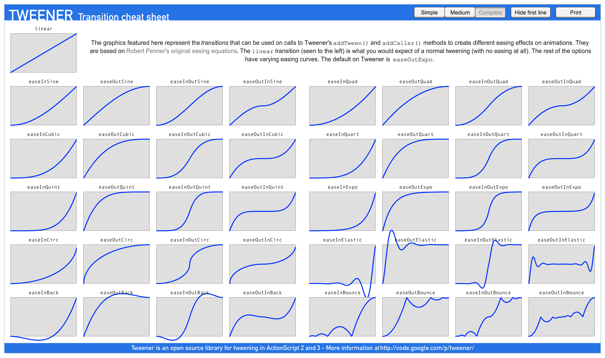

# Tween Functions

Engine implements a series of different types of tween functions, through which different real-time animation effects can be achieved. These tween functions are mainly used in the `Tween.to` and `Tween.by` interfaces.

## Built-in Tween Functions

The current tween functions provided by the engine are shown below:

```ts
export type TweenEasing =
'linear'    | 'smooth'     | 'fade'         | 'constant'     |
'quadIn'    | 'quadOut'    | 'quadInOut'    | 'quadOutIn'    |
'cubicIn'   | 'cubicOut'   | 'cubicInOut'   | 'cubicOutIn'   |
'quartIn'   | 'quartOut'   | 'quartInOut'   | 'quartOutIn'   | 
'quintIn'   | 'quintOut'   | 'quintInOut'   | 'quintOutIn'   |
'sineIn'    | 'sineOut'    | 'sineInOut'    | 'sineOutIn'    |
'expoIn'    | 'expoOut'    | 'expoInOut'    | 'expoOutIn'    |
'circIn'    | 'circOut'    | 'circInOut'    | 'circOutIn'    |
'elasticIn' | 'elasticOut' | 'elasticInOut' | 'elasticOutIn' |
'backIn'    | 'backOut'    | 'backInOut'    | 'backOutIn'    |
'bounceIn'  | 'bounceOut'  | 'bounceInOut'  | 'bounceOutIn';
```

The effect can be seen in the following figure:



Figure from [http://hosted.zeh.com.br/tweener/docs/en-us/](http://hosted.zeh.com.br/tweener/docs/en-us/)

The `ITweenOption` interface allows you to modify the tween function. The code example is as follows.

```ts
let tweenDuration: number = 1.0;                            // Duration of the tween
tween(this.node)
    .to(tweenDuration, { position: new Vec3(0, 10, 0) }, {  // 
        easing: "backIn",                                   // Tween function
    })
    .start();                                               // Start the tween
```

## ITweenOption

`ITweenOption` is an optional property interface definition for tween. The interfaces are all **optional** and can be used on demand. The full example is as follows:

```ts
let tweenDuration: number = 1.0;                            // Duration of the tween
tween(this.node)
    .to(tweenDuration, { position: new Vec3(0, 10, 0) }, {  // 
        easing: "backIn",                                   // Tween function
        onStart: (target?: object) => {                     // Tween function

        },
        onUpdate: (target: Vec3, ratio: number) => {        // Tween process
            this.node.position = target;                    // Assign the position of the node to the result calculated by the tween system
        },
        onComplete: (target?: object) => {                  // Start the tween

        },
        progress: (start: number, end: number, current: number, ratio: number): number => {
            // Return custom interpolation progress
            return 0.0;
        }
    })
    .start();                                               // Start the tween
```

The tween progress can also be customized through the `progress` interface, with the following code example:

```ts
tween(this.node)
    .to(1.0, {
        position: new Vec3(0, 100, 0),
    }, {
        progress: (start: number, end: number, current: number, ratio: number): number => {
            return math.lerp(start, end, ratio);
        }
    })
    .start()
```

For full API description, please refer to: [ITweenOption](%__APIDOC__%/en/interface/ITweenOption)
