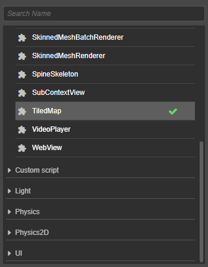

# TiledMap Component References

TiledMap is used to display a map in TMX format in the game.


Click the **Add Component -> Components -> TiledMap** button under the **Inspector** panel to add the TiledMap component to the node.



For the script interface of TiledMap, please refer to the [TiledMap API](%__APIDOC__%/en/class/TiledMap).

## TiledMap Properties

| Property | Description
| :---------------- | :----------------- |
| **Tmx Asset** | Specifies a map asset in `.tmx` format (Ensure the `.tmx` and `.tsx` are in the same folder)|
| **EnableCulling** | Enables culling, which needs to be turned off if the map needs to be rotated or placed in the 3D camera. If the map is not very large, e.g., less than 5000 blocks, then turning off culling reduces the CPU computational load and the GPU renders directly using the cache.

## Detailed Description

- After adding the TiledMap component, drag and drop a map asset in **.tmx** format from the **Assets** panel to the Tmx Asset property to see the map displayed in the scene.
- When the Tmx Asset property is added to the TiledMap component, nodes corresponding to the Layers in the map are automatically added to the nodes (floor, barrier, and players nodes in the image below). These nodes are added to the TiledLayer component. **Do not delete the TiledLayer component from these Layer nodes**.

    

- TiledMap component does not support the `mapLoaded` callback. It can be used normally in the `start` function.

## TiledLayer and Node Occlusion

The TiledLayer component converts the node coordinates added to the map layer into map block row coordinates. When rendering a map block in a map layer in row order, if there is a node in the row of the map block, then rendering of the map block will be interrupted in favor of rendering the node. After the nodes in the map block are rendered, the rendering of the map block will continue. In this way, the nodes and map layers are mutually occluded from each other.

> **Note**: this occlusion relationship is only related to the coordinates of the node, not the size of the node.

The following is an example of how the TiledLayer and the node can occlude each other.

1. Create a new node in the scene and add the TiledMap component. After setting the properties of the TiledMap component, the node with the TiledLayer component (i.e. map layer) will be generated automatically.

2. Create [Prefab](../../asset/prefab.md)s to instantiate multiple nodes in the scene.

3. Create a new TypeScript script in **Assets** panel to write component scripts. The script code is as follows:

    ```ts
    import { _decorator, Component, Node, TiledLayer, loader, Prefab, v2, instantiate, Vec3, EventTouch } from 'cc';
    const { ccclass, property } = _decorator;

    @ccclass('ShieldNode')
    export class ShieldNode extends Component {

        @property({ type: TiledLayer })
        public tiledLayer: TiledLayer | null = null;

        @property({ type: Prefab })
        public nodePrefab: Prefab | null = null;

        start () {
            this.initScene(this.nodePrefab!);
        }

        initScene (prefab: Prefab) {
            const posArr = [v2(-249, 96), v2(-150, 76), v2(-60, 54), v2(-248, -144), v2(-89, -34)];
            const tmpP = new Vec3();
            for (let i = 0; i < posArr.length; i++) {
                const shieldNode = instantiate(prefab);
                shieldNode.setPosition(posArr[i].x, posArr[i].y);
                this.tiledLayer!.addUserNode(shieldNode);
                shieldNode.on(Node.EventType.TOUCH_MOVE, (event:EventTouch) => {
                    const deltaMove = event.getDelta();
                    shieldNode.getPosition(tmpP);
                    tmpP.x += deltaMove.x;
                    tmpP.y += deltaMove.y;
                    shieldNode.setPosition(tmpP);
                });
            }
        }
    }
    ```

4. Attach the script component to the Canvas node, i.e. drag and drop the script into the **Inspector** panel of the Canvas node. Then drag and drop the automatically generated node with TiledLayer component from **Hierarchy** panel and the Prefabs from **Assets** panel to the corresponding property box of the script component, and then save the scene.

5. Click the Preview button at the top of the editor to see the effect of the nodes and map layers occluding each other. For the code, please refer to the [ShieldNode](https://github.com/cocos/cocos-test-projects/tree/v3.8/assets/cases/middleware/tiled-map) example.

    

To remove a node from a map layer, call the `removeUserNode` method of TiledLayer.
