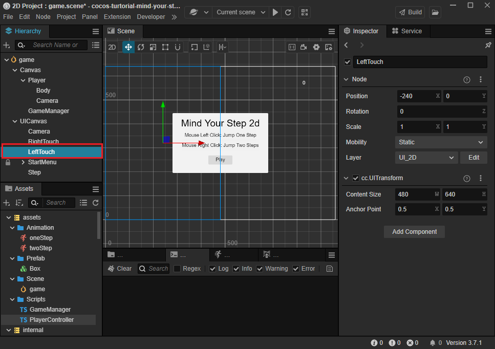

# 监听触摸事件

触摸事件可以通过监听 `Input.EventType.TOUCH_START` 来接收屏幕或者鼠标的事件。

监听方式有两种：

- 通过 `input.on` 的方式监听，这种方式会监听屏幕上所有的触摸
- 通过 `node.on` 的方式监听时，可以监听某个范围内的触摸事件

考虑到我们需要操作角色跳一步或者两步，因此我们选择将屏幕的左边的触摸用于处理跳一步的输入，而右边用于跳两步。

在 UI 层级里，也就是 `UICanvas` 节点下方创建两个空的节点，并分别命名为 LeftTouch 和 RightTouch：


参考下图设定好他们的位置和大小：




回到 `PlayerController` 在里面添加下列属性可以在角色上配置触摸区域：

```ts
@property(Node)
leftTouch: Node = null;

@property(Node)
rightTouch: Node = null;
```

并将刚才创建好的节点拖拽到上面去：


在 `PlayerController` 里面添加下面的代码：

- 监听触摸输入：

    ```ts
    setInputActive(active: boolean) {
        if (active) {    
            this.leftTouch.on(Input.EventType.TOUCH_START, this.onTouchStart, this);
            this.rightTouch.on(Input.EventType.TOUCH_START, this.onTouchStart, this);
        } else {        
            this.leftTouch.off(Input.EventType.TOUCH_START, this.onTouchStart, this);
            this.rightTouch.off(Input.EventType.TOUCH_START, this.onTouchStart, this);
        }
    }
    ```

- 添加响应触摸的回调：

    ```ts
    onTouchStart(event: EventTouch) {
        const target = event.target as Node;    
        if (target?.name == 'LeftTouch') {
            this.jumpByStep(1);
        } else {
            this.jumpByStep(2);
        }
    }
    ```

    `target` 在定义中是 `any` 类型，因此我们需要通过 `as` 关键字将其转化为 `Node` 类型。

    > 通过 as 关键字可以进行类型转换，前提是您得知道他是什么类型。

    取到触摸的目标后，我们就可以通过 `name` 这个属性来区分用户点击的是右侧的触摸区域还是左侧。

之后运行游戏就可以观察到触摸时的跳跃情况，此时可以通过手机应用扫描下图中的 QR 码来在移动设备上游玩（注意要在一个局域网内）。

完整的 `Playercontroller` 代码参考如下：

```ts
import { _decorator, Component, Vec3, EventMouse, input, Input, Animation, EventTouch, Node } from "cc";
const { ccclass, property } = _decorator;

export const BLOCK_SIZE = 40;

@ccclass("PlayerController")
export class PlayerController extends Component {

    @property(Animation)
    BodyAnim: Animation = null;

    private _startJump: boolean = false;
    private _jumpStep: number = 0;
    private _curJumpTime: number = 0;
    private _jumpTime: number = 0.3;
    private _curJumpSpeed: number = 0;
    private _curPos: Vec3 = new Vec3();
    private _deltaPos: Vec3 = new Vec3(0, 0, 0);
    private _targetPos: Vec3 = new Vec3();
    private _curMoveIndex = 0;

    @property(Node)
    leftTouch: Node = null;

    @property(Node)
    rightTouch: Node = null;

    start() {
        //input.on(Input.EventType.MOUSE_UP, this.onMouseUp, this);
    }

    setInputActive(active: boolean) {
        if (active) {
            //input.on(Input.EventType.MOUSE_UP, this.onMouseUp, this);
            this.leftTouch.on(Input.EventType.TOUCH_START, this.onTouchStart, this);
            this.rightTouch.on(Input.EventType.TOUCH_START, this.onTouchStart, this);
        } else {
            //input.off(Input.EventType.MOUSE_UP, this.onMouseUp, this);
            this.leftTouch.off(Input.EventType.TOUCH_START, this.onTouchStart, this);
            this.rightTouch.off(Input.EventType.TOUCH_START, this.onTouchStart, this);
        }
    }

    reset() {
        this._curMoveIndex = 0;
    }

    onTouchStart(event: EventTouch) {
        const target = event.target as Node;        
        if (target?.name == 'LeftTouch') {
            this.jumpByStep(1);
        } else {
            this.jumpByStep(2);
        }
    }

    onMouseUp(event: EventMouse) {
        if (event.getButton() === 0) {
            this.jumpByStep(1);
        } else if (event.getButton() === 2) {
            this.jumpByStep(2);
        }

    }

    jumpByStep(step: number) {
        if (this._startJump) {
            return;
        }
        this._startJump = true;
        this._jumpStep = step;
        this._curJumpTime = 0;

        const clipName = step == 1 ? 'oneStep' : 'twoStep';
        const state = this.BodyAnim.getState(clipName);
        this._jumpTime = state.duration;

        this._curJumpSpeed = this._jumpStep * BLOCK_SIZE / this._jumpTime;
        this.node.getPosition(this._curPos);
        Vec3.add(this._targetPos, this._curPos, new Vec3(this._jumpStep * BLOCK_SIZE, 0, 0));

        if (this.BodyAnim) {
            if (step === 1) {
                this.BodyAnim.play('oneStep');
            } else if (step === 2) {
                this.BodyAnim.play('twoStep');
            }
        }

        this._curMoveIndex += step;
    }


    onOnceJumpEnd() {
        this.node.emit('JumpEnd', this._curMoveIndex);
    }

    update(deltaTime: number) {
        if (this._startJump) {
            this._curJumpTime += deltaTime;
            if (this._curJumpTime > this._jumpTime) {
                // end
                this.node.setPosition(this._targetPos);
                this._startJump = false;
                this.onOnceJumpEnd();
            } else {
                // tween
                this.node.getPosition(this._curPos);
                this._deltaPos.x = this._curJumpSpeed * deltaTime;
                Vec3.add(this._curPos, this._curPos, this._deltaPos);
                this.node.setPosition(this._curPos);
            }
        }
    }
}
```
