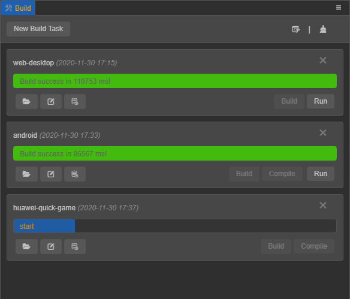
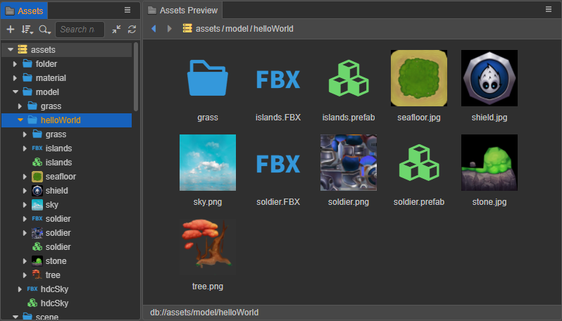
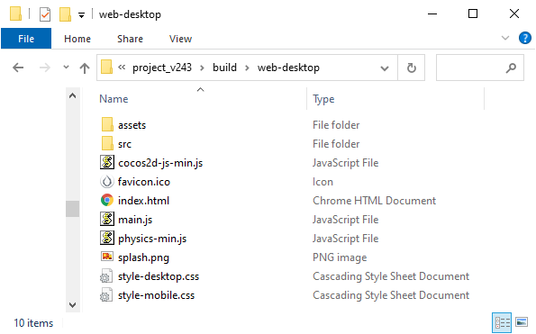
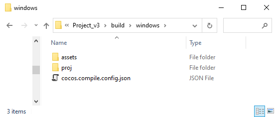
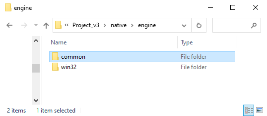
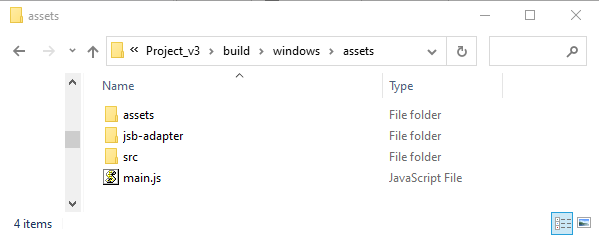
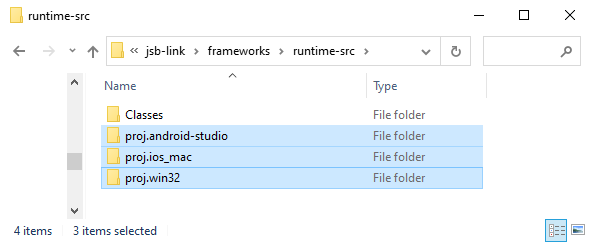
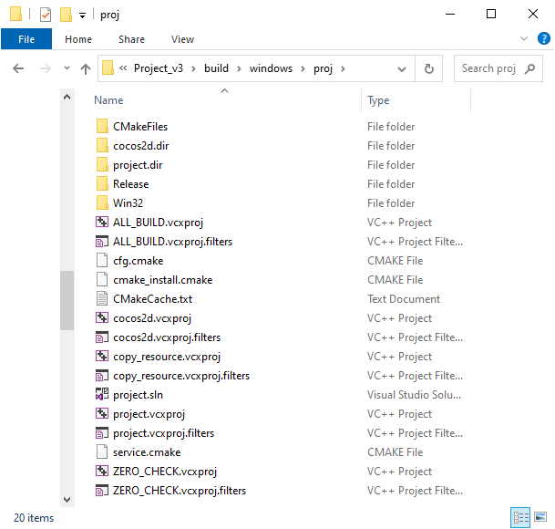
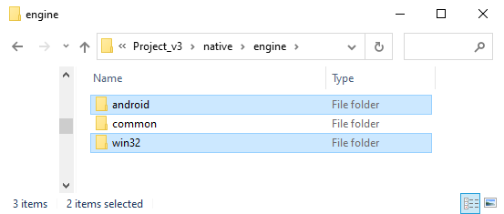
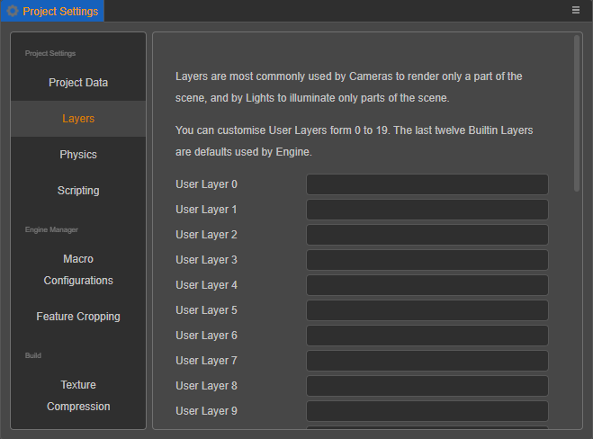

# Cocos Creator 3.0 升级指南

## 版本介绍

Cocos Creator 3.0 集成了原有 2D 和 3D 两套产品的所有功能，带来了诸多重大更新，将做为 Creator 之后的主力版本。同时 v3.0 还延续了 Cocos 在 2D 品类上轻量高效的优势，并且为 3D 重度游戏提供高效的开发体验。

- **对于 Cocos Creator 2.x**

  为了保障现有的 v2.4 项目平稳过渡，我们会将 v2.4 做为 LTS（长期支持）版本，提供后续 **两年** 的持续更新！在 **2021** 年，v2.4 将继续更新版本，提供缺陷修复和新的 Cocos Creator 小游戏平台支持，保障大家的项目成功上线。在 **2022** 年我们还将为开发者持续提供 v2.4 的关键问题修复，保障已上线的游戏平稳运营！因此：

    - **现有的 v2.x 项目可以安心继续开发，无需强制升级到 v3.0**。

    - **新项目建议使用 v3.0 版本开发**，我们会不断优化 v3.0 的开发体验和运行效率，支撑好 2D、3D 等不同品类的重度游戏顺利上线。

- **对于 Cocos Creator 3D**

  原有的 Cocos Creator 3D 做为 Creator 的分支版本，已经面向中国进行了长达一年的迭代，成功上线了 **星空大决战**、**最强魔斗士** 等重度项目！Cocos Creator 3.0 发布后，Cocos Creator 3D 也将包含在 v3.0 中，现有的 v1.2 项目都可直接升级，因此 Cocos Creator 3D 后续不会再发布独立版本。

Cocos Creator 3.0 使用了面向未来的全新引擎架构，将为引擎带来高性能、面向数据以及负载均衡的渲染器，并且无缝支持 Vulkan & Metal 多后端渲染，未来还会支持移动端 VR/AR 及部分主机平台。

关于 Cocos Creator 3.0 的详细介绍，请移步 [官网更新说明](https://cocos.com/creator)。

## 如何迁移 Cocos Creator 2.x 项目

虽然 **我们不建议开发中的项目，特别是即将上线的项目强升 v3.0**，但是我们仍在 Cocos Creator 3.0 推出了 v2.x 资源导入工具。此工具支持旧项目资源完美导入，以及代码的辅助迁移。

### 资源导入

开发者只需要点击主菜单中的 **文件 -> 导入 Cocos Creator 2.x 项目**。


然后在弹出的文件浏览对话框中选择 v2.x 项目的根目录。


> **注意**：旧项目推荐先升级到 v2.4.3 或以上版本，然后再导入到 v3.0，否则无法确保导入结果的正确性。

v2.x 项目中所有的资源便会自动呈现在弹出的 **导入 Cocos Creator 2.x 项目** 面板中，开发者可以再次确认要导入的资源，然后点击面板右下角的 **导入** 按钮完成导入。若开发者想要切换导入的 v2.x 项目，点击下图中的搜索图标按钮，即可重新选择项目。


面板左下角的 **使用说明** 按钮可跳转到导入项目插件的 GitHub 仓库，用于 [更新导入插件](https://github.com/cocos-creator/plugin-import-2.x/blob/main/README.md) 或者提交反馈。

### 代码迁移

当导入使用 JavaScript 进行开发的 v2.x 项目时，导入插件的代码辅助迁移功能会先将 JavaScript 转换成 TypeScript，再进行代码迁移。

例如，导入的 v2.x 项目 JavaScript 代码如下：

```typescript
// AudioController.js
cc.Class({
    extends: cc.Component,

    properties: {
        audioSource: {
            type: cc.AudioSource,
            default: null
        },
    },

    play: function () {
        this.audioSource.play();
    },

    pause: function () {
        this.audioSource.pause();
    },

});
```

由于各个项目代码的写法差异以及不同的复杂程度，目前导入插件对代码的迁移仅添加 **组件类型声明**、**属性声明** 和 **函数声明**，组件在场景中的引用都会得到 **保留**，并且函数内部的代码会以 **注释** 的形式迁移。<br>
另外，v2.x 的原代码则会以注释的形式完整保留一份在迁移后代码的末尾，方便开发者手动转换时参考。

上述示例代码在经过导入插件的代码辅助迁移之后，结果如下所示：

```typescript
// AudioController.ts

import { _decorator, Component, AudioSource } from 'cc';
const { ccclass, property } = _decorator;

@ccclass('AudioController')
export class AudioController extends Component {
    @property
    public audioSource:AudioSource = 'null';

    play () {
        //this.audioSource.play();
    }

    pause () {
        //this.audioSource.pause();
    }

}


/**
 * 注意：已把原脚本注释，由于脚本变动过大，转换的时候可能有遗落，需要自行手动转换
 */
// cc.Class({
//     extends: cc.Component,
// 
//     properties: {
//         audioSource: {
//             type: cc.AudioSource,
//             default: null
//         },
//     },
// 
//     play: function () {
//         this.audioSource.play();
//     },
// 
//     pause: function () {
//         this.audioSource.pause();
//     },
// 
// });
```

> **注意**：
>
> 1. 如果是从 JavaScript 转换为 TypeScript 的。需要在 TypeScript 中声明 **所有属性** 并设置默认值。
> 2. 如果 **属性检查器** 面板数据丢失，则需要检查属性类型是否与 v2.x 相同。
> 3. 如果 JavaScript 代码使用外部类型，TypeScript 会提示：通过导入外部源文件或声明进行修复。

## 旧版本开发者快速上手

### 材质升级

在 v3.0 中我们持续改进了材质系统的设计和内置 Shader API，所以从 v2.x 升级到 v3.x 时，部分内容无法自动升级，还需要开发者手动进行调整，详情请参考 [材质升级指南](../material-system/effect-2.x-to-3.0.md)。

### 引擎 API 升级

#### 针对 Cocos Creator 3D 1.2 用户

1. Cocos Creator 3.0 资源加载相关的 API 与 v2.4 一致，都对 `loader` 进行了重构，v1.2 用户可参考 [v2.4 资源管理模块升级指南](https://docs.cocos.com/creator/2.4/manual/zh/release-notes/asset-manager-upgrade-guide.html) 进行升级。

2. 组件类名更改

    为了符合 v2.x 的 API 规范，Cocos Creator 3.0 将组件类名包含 Component 后缀这样的命名方式舍弃了，并做了数据的自动升级和代码的兼容。

    不过建议开发者还是要在代码中搜索所有类似命名方式的使用，并尽快更改为无 Component 后缀的类名。可以使用下面正则表达式进行全局搜索（打开大小写敏感和正则匹配）：

    ```
    ([A-Z]\w+)Component
    ```

#### 针对 Cocos Creator 2.x 用户

- 节点上 UI 相关接口变更如下：

    - 与坐标变换计算相关的接口（例如：`size` 和 `anchor`）变更如下：

        需要先获取节点上的 `UITransform` 组件，再使用对应的接口，例如：

        ```typescript
        const uiTrans = node.getComponent(UITransform)!;
        uiTrans.anchorX = 0.5;
        uiTrans.setContentSize(size);
        ```

    - 其余接口变更如下：

        - `color`：需要先获取节点上的渲染组件（例如：`Sprite` 组件），再使用对应的接口。

        - `opacity`：如果节点上有渲染组件，直接设置渲染组件的 `color`。如果没有渲染组件，则可以通过添加 `UIOpacity` 组件，并设置相关属性。

        - `skew`：该接口已被移除。

        - `group`：变更为 `layer`。

        - `zIndex`：变更为 `UITransform` 中的 [priority](%__APIDOC__%/zh/class/UITransform)。

          > **注意**：从 v3.1 开始，`priority` 属性已弃用，若需要调整节点树的顺序请使用 `setSiblingIndex` 方法。

- `CCSpriteFrame`：

    - 移除接口：`copyWithZone`、`copy`、`clone` 和 `ensureLoadTexture`。

    - 变更接口：

        - `setFlipX` 和 `isFlipX` -> `flipUVX`

        - `setFlipY` 和 `isFlipY` -> `flipUVY`

        - `getTexture` 和 `setTexture` -> `texture`（此处的类型是 Texture2D/RenderTexture）。

    - 其余 `get` 和 `set` 对应的方法在 3.0 中都直接对应同名属性（例如：`getOffset` -> `offset`）。

- `CCTexture2D`：

    - 变更接口：`genMipmaps` -> `mipmaps`、`initWithElement` -> `image`。

    - `initWithData` 整个方法被移除，类似的使用是将原先要传入的 `ArrayBufferView` 数据，传给新建的 `ImageAsset`，然后再用 `ImageAsset` 传给新建的 `Texture2D`，从而获得一份图片资源。

- `cc.Action`：相关接口全部移除。

- **物理**：

    - 2D 变更组件：`cc.Collider` -> `Collider2D`、`cc.BoxCollider` -> `BoxCollider2D`、`cc.RigidBody` -> `RigidBody2D` 等。

    - 3D 变更组件：`cc.Collider3D` -> `Collider`、`cc.BoxCollider3D` -> `BoxCollider`、`cc.RigidBody3D` -> `RigidBody` 等。

- **tween**：

    - 变更接口：`cc.repeatForever` -> `Tween.repeatForever`、`cc.reverseTime` -> `Tween.reverseTime`、`cc.show` -> `Tween.show` 等。

- **动画**：

    - 变更接口：`addClip` -> `createState`、`getClips` -> `clips`、`playAdditive` -> `crossFade`、`getAnimationState` -> `getState` 等。

- **相机**：

    - 移除接口：`findCamera`、`alignWithScreen`、`main`、`cameras`、 `zoomRatio` 和 `containsNode`。

    - 变更接口：`backgroundColor` -> `clearColor`、`cullingMask` -> `visibility`、`depth` -> `clearDepth`、`getScreenToWorldPoint` -> `screenToWorld`、`getWorldToScreenPoint` -> `worldToScreen`、`getRay` -> `screenPointToRay` 等。

- **音频**：

    - 变更接口：`getLoop` 和 `setLoop` -> `loop`、`getVolume` 和 `setVolume` -> `volume`、`getCurrentTime` 和 `setCurrentTime` -> `currentTime`、`src` -> `clip`。

- **材质**：

    - 所有相关改动都需要获得 **MeshRenderer** 或其子类身上的 **材质实例** 来完成。

    - 移除接口：`setBlend`、`setDepth`、`setStencilEnabled`、`setStencil`、`setCullMode` 和 `define`，其中除了 `define` 是调用 `recompileShaders` 完成更新，其余的都是调用 `overridePipelineStates` 完成更新。

- **sys** 下的平台变量变更如下：

| Cocos Creator 2.x | Cocos Creator 3.0     |
| :---------------- | :-------------------- |
| `BAIDU_GAME`      | `BAIDU_MINI_GAME`     |
| `VIVO_GAME`       | `VIVO_MINI_GAME`      |
| `OPPO_GAME`       | `OPPO_MINI_GAME`      |
| `HUAWEI_GAME`     | `HUAWEI_QUICK_GAME`   |
| `XIAOMI_GAME`     | `XIAOMI_QUICK_GAME`   |
| `JKW_GAME`        | `COCOSPLAY`           |
| `ALIPAY_GAME`     | `ALIPAY_MINI_GAME`    |
| `BYTEDANCE_GAME`  | `BYTEDANCE_MINI_GAME` |

- **全局变量** 变更如下：

| Cocos Creator 2.x | Cocos Creator 3.0 |
| :---------------- | :---------------- |
| `CC_BUILD`        | `BUILD`           |
| `CC_TEST`         | `TEST`            |
| `CC_EDITOR`       | `EDITOR`          |
| `CC_PREVIEW`      | `PREVIEW`         |
| `CC_DEV`          | `DEV`             |
| `CC_DEBUG`        | `DEBUG`           |
| `CC_JSB`          | `JSB`             |
| `CC_WECHATGAME`   | `WECHATGAME`      |
| `CC_RUNTIME`      | `RUNTIME_BASED`   |
| `CC_SUPPORT_JIT`  | `SUPPORT_JIT`     |

- **动态加载资源**：

    在 v3.0 中使用 `bundle.load` 或 `resources.load` 动态加载 `sprite-frame` 或 `texture` 时，需要将路径指定到具体的子资源：

    ```ts
    // 加载 texture

    // v2.x
    resources.load('background', cc.Texture2D, () => {});
    // v3.0
    resources.load('background/texture', Texture2D, () => {});
    ```

    ```ts
    // 加载 sprite frame

    // v2.x
    resources.load('background', cc.SpriteFrame, () => {});
    // v3.0
    resources.load('background/spriteFrame', SpriteFrame, () => {});
    ```
##### `JSB` 接口相关

- `jsb.FileUtils`
     - `getDataFromFile` 返回类型由 `Uint8Array` 变为 `ArrayBuffer`
     
### 编辑器升级

#### 构建发布面板

Cocos Creator 3.0 中所有平台的构建都内置为插件，因此 **构建发布** 面板也与 v2.4 的不同，各平台独有的构建选项会单独放在一个可折叠的 section 控件内。


点击 **构建** 按钮后会跳转到 **构建任务** 面板，所有构建后的平台都会显示在这个面板中。可以在这个面板中修改构建后工程的构建选项再重新构建、可以查看构建日志、打开工程目录等。如果需要返回 **构建发布** 面板编译其他平台的话，点击 **构建任务** 面板左上方的 **新建构建任务** 按钮即可。



另外，构建时支持构建成文件分离的多模块结果，便于多模块并发加载、动态加载模块，并且微信引擎插件支持选择不同物理引擎后端。构建完成后生成的 `settings.js` 也改为 `settings.json`，并放置在 `src` 目录下，允许作为资源上传到服务器。

#### 资源缩略图面板

在 **资源管理器** 中选中资源，即可在 **资源预览** 面板中显示资源的缩略图。若选中资源所在的文件夹，即可显示文件夹下所有资源的缩略图，方便查看。



#### 动画编辑器升级

- 支持节点树面板中对节点的搜索与显示过滤
- 支持使用系统剪贴板复制粘贴节点上的所有动画数据（节点、轨道以及关键帧）
- 支持多选节点后批量添加属性轨道
- 优化关键帧选取和取消选取的操作体验（Ctrl + 鼠标点击选中关键帧可取消选中）
- 支持在动画编辑状态下继续编辑节点属性，包括粒子和模型材质属性等


#### 项目设置面板更新

分成 **Engine 管理器**、**项目设置**、**构建发布** 三大部分。

物理碰撞组独立使用 `PhysicsSystem.PhysicsGroup` 类型，不再与 `Node.Layers` 共享分组配置：


**压缩纹理配置** 修改为在 **项目设置 -> 构建发布** 中配置预设。在 **资源管理器** 中选中图片资源，然后再在 **属性检查器** 中选择预设的方式。<br>
旧项目升级后，编辑器会自动扫描项目内的所有压缩纹理配置情况，整理出几个预设。由于是自动扫描的，生成的名称可能不是想要的，可以自行在此处修改：


#### 编辑器插件系统升级

Cocos Creator 3.0 拥有更加强大的插件系统，编辑器几乎所有功能模块都是以插件形式存在。你可以在扩展菜单中快速创建自己的插件，从而实现自己想要的效果。另外，Cocos Creator 3.0 还提供了扩展管理器，可以轻松管理所有扩展插件的运行和卸载。


### 构建目录差异

Cocos Creator 2.x 不同平台构建后生成的目录与 Cocos Creator 3.0 也有着一定程度上的差异。接下来我们以 v2.4.3 为例，和 v3.0 分别在 Web、原生和微信小游戏平台上进行对比。

#### Web 平台

v2.4.3 构建 Web Desktop 平台后生成的目录：



v3.0 构建 Web Desktop 平台后生成的目录：


从以上两张图可以看出 Web 平台构建后生成的内容，v2.4.3 与 v3.0 大部分是相同的，不同之处包括以下几点：

1. v3.0 将引擎相关的代码，例如核心模块、物理模块、插件脚本等都统一放到了 **cocos-js** 目录下，相比 v2.4.3 分散放在构建目录中看起来更加清晰。

    

2. v2.4.3 只有一个启动脚本 `main.js`，而 v3.0 则有以下两个启动脚本：
    - `index.js`：用于做一些预处理工作
    - `application.js`：用于启动游戏

3. v2.4.3 中用于管理配置的 `src/settings.js` 在 v3.0 改为 `src/settings.json`。

4. v2.4.3 中的首屏图片 `splash.png`，在 v3.0 则默认存储在 `settings.json` 中。

5. v2.4.3 中的 `style-desktop.css` 和 `style-mobile.css`，在 v3.0 则合并为 `style.css`。

#### 微信小游戏平台

v2.4.3 构建微信小游戏后生成的目录：


v3.0 构建微信小游戏后生成的目录：


从以上两张图可以看出微信小游戏平台构建后生成的内容，v2.4.3 与 v3.0 大部分是相同的，不同之处包括以下几点：

1. v3.0 将引擎相关的代码，例如核心模块、物理模块、插件脚本等都统一放到了 `wechatgame/cocos-js` 目录下。而 v2.4.3 则分散一部分放在 `wechatgame` 目录下，一部分放在 `wechatgame/cocos` 目录下。

    

2. v2.4.3 将小游戏的适配层代码都编译到 `adapter-min.js` 中，而 v3.0 则是将适配层代码全部以散文件的形式存储在 `libs` 目录下，没有进行编译。

3. v2.4.3 的启动脚本是 `main.js`，v3.0 的启动脚本则是 `application.js`。

4. v2.4.3 将所有动态代码的引用记录在了 `ccRequire.js` 中，而 v3.0 目前暂时没有这个功能。

5. v2.4.3 中用于管理配置的 `src/settings.js` 在 v3.0 改为 `src/settings.json`。

#### 原生平台

v2.4.3 构建 Windows 平台后生成的发布包目录如下：


v3.0 构建 Windows 平台后生成的发布包目录如下：



从以上两张图可以看出 Windows 平台构建后生成的发布包目录，v2.4.3 与 v3.0 差异较大：

1. v2.4.3 的发布包名称是以 **构建发布** 面板中的 **构建模板** 命名的（例如 `jsb-link`），v3.0 则是以 **当前构建的原生平台** 命名的（例如 `windows`、`Android`）。

2. 因为各个原生平台（例如 Android、Windows）构建后生成的底层 C++ 代码是完全一致的，所以在 v3.0，我们将 v2.4.3 存放在发布包目录 `frameworks/runtime-src/Classes` 中的底层 C++ 代码单独提取出来放在共享的项目目录下的 `native/engine/common` 文件夹中。这样在构建原生平台时，如果检测到已经存在该文件夹，这部分内容便不会再进行处理，加快构建速度。

    

3. v2.4.3 发布包目录中应用层相关的文件，在 v3.0 都统一合并到了 `assets` 目录中。

    v2.4.3 应用层相关的文件包括：

    - `assets` 目录（资源）
    - `jsb-adapter` 目录（适配层代码）
    - `src` 目录（引擎相关代码、插件脚本、配置管理脚本 `settings.js` 等）
    - 相关配置文件（`.cocos-project.json`、`cocos-project-template.json`、`project.json`）
    - 启动脚本（`main.js`）

    v3.0 `assets` 目录结构如下：

    

    v3.0 在合并的过程中也做了相应的调整和改动：

    - 原 v2.4.3 全部放在发布包目录 `src` 目录下的引擎相关代码（例如核心模块、物理模块、插件脚本等），在 v3.0 都放到了发布包目录 `assets/src/cocos-js` 目录下。

    - 原 v2.4.3 中用于管理配置的 `src/settings.js`，在 v3.0 改为 `assets/src/settings.json`。

4. v2.4.3 会将所有原生平台的构建工程都生成在发布包目录 `frameworks/runtime-src` 目录下：

    

    而 v3.0 则是将构建工程生成在发布包目录 `proj` 目录下，且只生成当前构建平台的工程：

    

    同时，v3.0 也做了代码和配置的分离，将一部分代码和配置放入源码管理，位于项目目录下的 `native/engine/当前构建的平台名称` 文件夹中（例如 `native/engine/win32`、`native/engine/android`）。开发者可以在这里集成 SDK 或者做二次开发，删除构建后生成的发布包目录（例如 `build/windows`）不会影响已经集成的 SDK。

    

5. 一些编译时需要用到的资源，例如应用图标、应用启动脚本等，v2.4.3 是存储在构建工程中，而 v3.0 则是存储在项目目录的 `native/engine/当前构建的平台名称` 文件夹中。

## 升级常见问题（FAQ）

### 升级后项目脚本在 VS Code 打开时，绑定组件定义等操作出现报红现象

Cocos Creator 3.x 开启了 TypeScript 的严格模式，会对代码进行更严格的审查，排除开发过程中可能会出现的因为疏忽而导致的问题。

如果不想使用严格模式，可以在 Creator 顶部菜单栏的 **项目 -> 项目设置 -> 脚本** 中勾选 **启用宽松模式**。需要提醒的是，我们并不鼓励关闭严格模式，因为严格空值检查能够减少代码运行时的一些低级报错。

关于严格模式下的书写规范，可以参照官方案例 **快上车 3D**（[GitHub](https://github.com/cocos/cocos-tutorial-taxi-game) | [Gitee](https://gitee.com/mirrors_cocos-creator/tutorial-taxi-game)）。

### Action 动作全都失效

因为 Cocos Creator 3.x 移除了 Action 动作系统，统一使用 Tween 缓动系统。

### 修改 2D 节点的 `size` 和 `anchor` 不生效

需要先获取节点上的 UITransform 组件，再使用对应的接口，例如：

```typescript
const uiTrans = node.getComponent(UITransform)!;
uiTrans.anchorX = 0.5;
uiTrans.setContentSize(size);
```

### 修改 2D 节点的 `color` 不生效

需要先获取节点上的渲染组件（例如 Sprite 组件），再使用对应的接口，例如：

```typescript
const uiColor = node.getComponent(Sprite)!;
uiColor.color = color(255,255,255);
```

### 修改 2D 节点的 `skew` 不生效

从 v3.0 开始，`skew` 接口已经被移除。

### 无法获取分组，但 Creator 的项目设置面板中仍有分组设置（Layers）

v2.x 的 `group` 分组管理从 v3.0 开始变更为 `Layer`，如下图所示。在 v2.x 中通过 `node.group` 获取到的是分组名，而在 v3.x 通过 `node.layer` 获取到的是 **分组值**，并且分组值是以 2 的指数幂设定。



User Layer 0 的 layer 值为：2<sup>0</sup> = 1。<br>
User Layer 1 的 layer 值为：2<sup>1</sup> = 2。<br>
User Layer 6 的 layer 值为：2<sup>6</sup> = 64。

### 通过 `zIndex` 设置同级节点失效

从 v3.0 开始 `zIndex` 接口已经被移除，若需要调整节点树的顺序请使用 `setSiblingIndex` 方法来替换使用。

### 通过 `getComponent()` 无法获取到节点上挂载的脚本

请查询对应脚本的类名，而不是脚本名，因为在 v3.x 中脚本组件是以脚本中定义的类名为准的，而不是脚本名。常出现因为大小写而导致脚本找不到的问题。详情请参考 [创建脚本](../scripting/setup.md)。

### 动态加载 `resources` 文件夹下的图片时提示找不到

图片设置为 `sprite-frame`、`texture` 或其他图片类型后，将会在 **资源管理器** 中生成一个对应类型的资源。但如果直接加载 `testAssets/image`，得到的类型将会是 `ImageAsset`，必须指定路径到具体的子资源。

例如一张设置为 `sprite-frame` 类型的图片在 `resources` 文件夹下的路径为 `testAssets/image`，那么要加载 `SpriteFrame` 应该这么写：

```typescript
resources.load("testAssets/image/spriteFrame", SpriteFrame, (err, spriteFrame) => {
    this.node.getComponent(Sprite).spriteFrame = spriteFrame;
});
```

若加载的是 `texture` 类型的图片，则将 `spriteFrame` 修改为 `texture` 即可。

### 物体产生物理碰撞之后，原有的物理碰撞回调没有了

从 v3.0 开始，碰撞体回调需要在开始的时候进行注册，与原先 v2.x 会直接产生回调不同。因此开发者需要在物理回调的脚本中增加对回调函数的注册。例如：

```typescript
let collider = this.getComponent(Collider2D);
if (collider) {
    // 只在两个碰撞体开始接触时被调用一次
    collider.on(Contact2DType.BEGIN_CONTACT, this.onBeginContact, this);
    // 只在两个碰撞体结束接触时被调用一次
    collider.on(Contact2DType.END_CONTACT, this.onEndContact, this);
    // 每次将要处理碰撞体接触逻辑时被调用
    collider.on(Contact2DType.PRE_SOLVE, this.onPreSolve, this);
    // 每次处理完碰撞体接触逻辑时被调用
    collider.on(Contact2DType.POST_SOLVE, this.onPostSolve, this);
    }
});
```

### 升级之后，物理碰撞分组不见了

目前导入插件还不支持物理碰撞矩阵，因此暂时需要开发者手动设置碰撞矩阵，可在 Creator 主菜单 **项目 -> 项目设置 -> 物理** 中重新设置。

### 音频系统的 `audioEngine` 接口失效，无法播放音频

从 v3.0 开始，移除了 `audioEngine` 接口，统一使用 **AudioSource** 组件来控制音频的播放。详情请参考 [AudioSource 组件](../audio-system/audiosource.md)。

### Button 按钮无法点击

排除代码和渲染层级问题，请查看 **Button** 节点的 `Scale` 属性中 `Z` 轴的值是否为 0，如果是，将其修改为 1 即可。

### 升级后对脚本进行修改，出现编辑器卡死的情况

检查升级后脚本中定义的组件类型的属性装饰器 `property` 是否未定义，如果未定义，则是由于导入插件太过于老旧导致的，请参考 [插件升级](https://github.com/cocos-creator/plugin-import-2.x) 对导入插件进行更新升级。更新导入插件后，需要 **重新进行项目升级**。

### 升级后在脚本中修改节点的 `Position` 时，直接通过节点（例如 `node.x`）修改不生效

从 v3.0 开始，`node` 节点上不允许直接访问坐标位置，需要先访问 `position` 再访问坐标值。并且 v3.x 中的 `position` 为 **只读属性**，若需要修改，请使用 `setPosition` 方法。例如：

```typescript
// v2.x

// 访问坐标轴
let xAxis = this.node.x;
// 修改 X 轴坐标
this.node.x = 200;

// v3.x

// 访问坐标轴
let xAxis = this.node.position.x;
// 修改 X 轴坐标
this.node.setPosition(200);
```

## TypeScript 参考教程

- [Cocos Creator 3.0 TypeScript 问题答疑及经验分享](https://forum.cocos.org/t/topic/106995)
- [TypeScript 官方网站](https://www.typescriptlang.org/)
- [TypeScript - Classes](https://www.typescriptlang.org/docs/handbook/classes.html)
- [TypeScript - Decorators](https://www.typescriptlang.org/docs/handbook/decorators.html)
- [TypeScript - DefinitelyTyped](http://definitelytyped.org/)
- [X 分钟速成 TypeScript](https://learnxinyminutes.com/docs/zh-cn/typescript-cn/)
- [TypeScript 源码](https://github.com/Microsoft/TypeScript)
- [开发者回避使用 TypeScript 的三个借口 — 以及应当使用 TypeScript 的更有说服力的原因](https://mp.weixin.qq.com/s/7QQJxErt2-e4jLK2_4GUFA)
