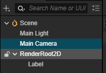
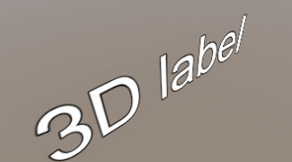

# RenderRoot2D 组件

RenderRoot2D 组件是 [Canvas](./canvas.md) 的基类，任何需要显示的 2D/UI 节点都 **必须要挂载在 RenderRoot2D 下才** 可以正确的显示。

RenderRoot2D 只会搜集子节点下的所有和 2D/UI 相关组件的需要绘制的信息，并提交给渲染引擎。即使将 3D 对象如 Mesh，放在 RenderRoot2D 所在的节点下，RenderRoot2D 也不会搜集该 3D 对象的几何信息。

RenderRoot2D 必须要配合 UITransform 组件使用。在添加 RenderRoot2D 时，会自动添加 UITransform 组件。

典型的 RenderRoot2D 的应有两方面：

- 继承类 [Canvas](./canvas.md) 用于处理 2D/UI 组件的绘制、适配等。
- 在 3D 空间内绘制 2D/UI 元素

因此如果您尝试制作如 3D Label 如玩家血条之类的元素，可考虑使用 RenderRoot2D 作为父节点。

需要注意，如果手动创建 2D 元素，Cocos Creator 会自动创建 Canvas 节点。

如果要创建在 3D 空间内的 Label，在创建后删除 Canvas、Camera 节点，并将 Label 拖拽到 RenderRoot2D 节点下即可正常显示。

另外需要注意的是，通常场景内的默认相机，是不绘制 UI_2D 层级，需要修改 RenderRoot2D 下节点的层级为可见层级，通常为 UI_3D。

